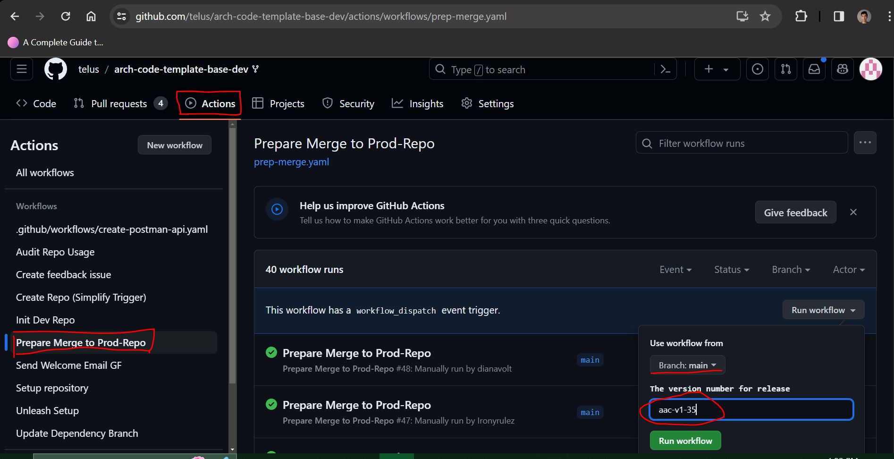
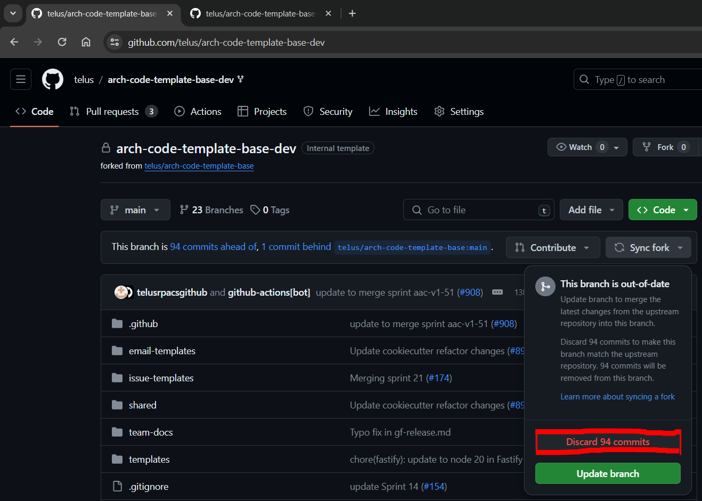
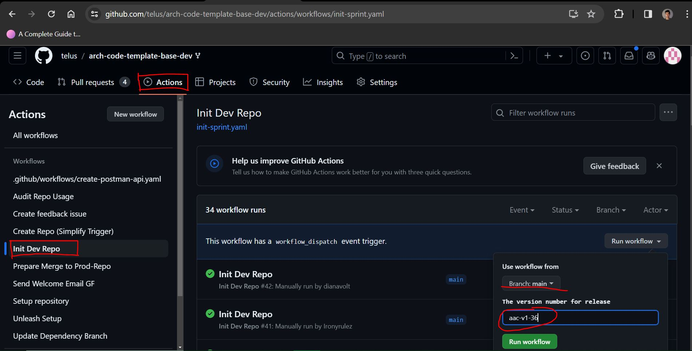
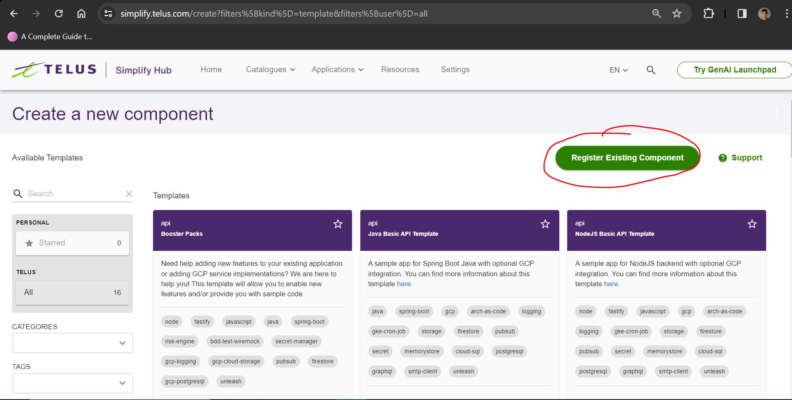

# Release Instructions for Greenfield (GF) Templates

Before you begin, you will need someone to approve all the Pull Requests as part of the release process.

## 1. Prepare the GF dev repo for the release
Run **Prepare Merge to Prod-Repo** workflow on the [GF dev repo](https://github.com/telus/arch-code-template-base-dev) (using the workflow from `main` and specifying `aac-v1-<current sprint number>`, where the current sprint is the one that is about to end); this will create a Pull Request against the repo's `main` branch. Merge the Pull Request.

## 2. Merge GF dev to GF prod
Create a new Pull Request from the GF dev repo to the [GF prod repo](https://github.com/telus/arch-code-template-base), and merge it into the production repo.

## 3. Sync changes on the GF dev repo
Return to the GF dev repo and sync the changes by selecting **Discard commits** (you will need an admin to
disable branch protection, and enable force-push. Ping Kurosh, Ross, or Ricardo for this.)

## 4. Initialize the GF dev repo for the next sprint
Run **Init Dev Repo** workflow on the [GF dev repo](https://github.com/telus/arch-code-template-base-dev) (using the workflow from `main` and specifying `aac-v1-<next sprint number>`, where the next sprint is the one that is about to start); this will create a Pull Request against the repo's `main` branch. Merge the Pull Request.

## 5. Re-register Simplify Templates
If there were any changes to the Simplify template `.yaml` files, you will need to update them on [Simplify production](https://simplify.telus.com/create?filters%5Bkind%5D=template&filters%5Buser%5D=all). Use the **Register Existing Component** tool in Simplify to re-register the template `.yaml` (enter the Github URL of the `.yaml` file that was updated.)

## 6. Update Release Notes
Update the Architecture-as-Code [release notes markdown](https://github.com/telus/architecture-as-code/blob/main/docs/release-notes.md) (assuming the templates had any changes this sprint.)
