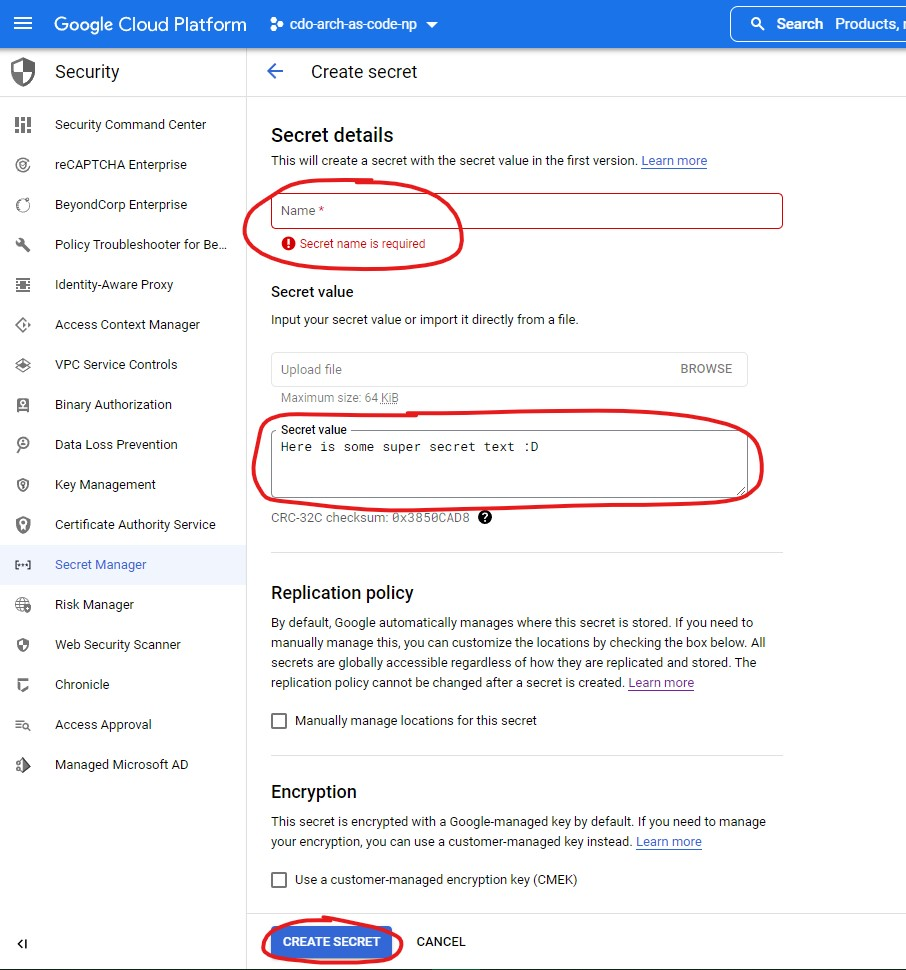

# **Secret Manager**
Secret Manager is a secure and convenient storage system for API keys, passwords, certificates, and other sensitive data. Secret Manager provides a central place and single source of truth to manage, access, and audit secrets across Google Cloud.

Teams should **NOT** store any sensitive data in any file especially on GitHub. As teams across TELUS will have access to repos, it's recommended to use GCP Secret Manager to store any sensitive data such as certs, API Keys, passwords required by the application.

You can find additional details about [Secret Manager features here](https://cloud.google.com/secret-manager).

# **Setup for Send Email Example**

The sample application requires 2 pre-configured secrets: one for the **Client ID** and one for the **Client Secret**. This document will guide you through the secret
creation process on GCP. You can access the Secret Manager through the GCP console for your project - under **Navigation Menu > Security > Secret Manager**.

Create a new secret by clicking the **Create Secret** button. If you were creating a secret for the Client ID for example, then enter:
- The secret's name (save this name in notepad for reuse later)
- The Client ID (given in the API marketplace notification email) as the Secret value
- Default values for all other options

Repeat this for the Client Secret, then continue [configuring the app](api-call-setup.md).
