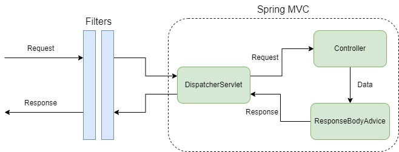

# Request & Response Lifecycle with Java Spring Boot

Filters and ResponseBodyAdvices can be used in a Java Spring Boot application to help separate request/response handling logic from business logic. More precisely:

- **Filters** are triggered before a request hits the DispatcherServlet, or when a response is returned by the DispatcherServlet. This makes them useful for handling
global (or nearly global) request/response logic - for example, authentication is something that should occur in (nearly) any request.
- **Controllers** contain the business logic associated with a given endpoint - any endpoint-specific validation of fields should be done here.
- **ResponseBodyAdvices** are used to modify the returned data from a controller, before the HTTP response is written. This gives control over the payload of the
HTTP response, and can be used to handle data from multiple controllers that return the same object type.

## Registering a ResponseBodyAdvice

ResponseBodyAdvices are registered automatically by adding the `@ControllerAdvice` annotation to the class implementing `ResponseBodyAdvice<T>` (where `T` is the object
type that this advice will modify.) The ResponseBodyAdvice's `supports()` method will determine whether or not a given advice class should apply to a given outgoing response.
See [this example advice class](../src/main/java/com/telus/samples/api/BirthdayMessageBodyAdvice.java) for more details.

## Registering a Filter

Filters can be automatically registered by adding the `@Component` annotation to the class implementing the `Filter`, with `@Order` annotation to determine the order in
which the filters will be applied. However for finer-grained control (e.g. only applying the filter for certain URL paths), they need to be registered via a Configuration
class ([check out this example](../src/main/java/com/telus/samples/config/FilterInterceptorConfig.java)). Note that in this setup:
- The configuration class has `@Configuration` annotation and implements `WebMvcConfigurer`
- The class implementing `Filter` does not require `@Component` anymore, [as in this example](../src/main/java/com/telus/samples/filter/DemoFilter.java)
- Order can be set using `registrationBean.setOrder()`