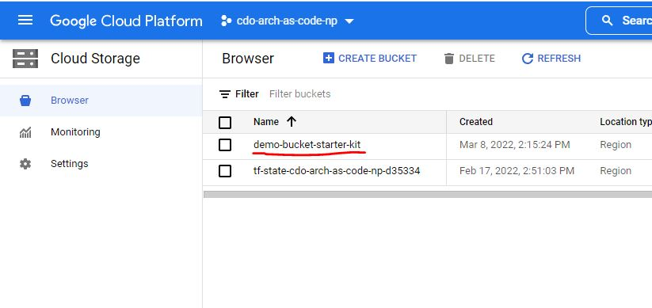

# **Local File dependency**

## **Considerations when using Cloud Storage**

When preparing to migrate an application to the cloud, it's important that there are no local file dependency. The application will need to be refactored to remove any local file system dependency to use Google Cloud Storage. 

This will prevent the ability of the application to be easily containerized and scaled. 

Team should consider the following storage options:

- Cloud Storage
- Cloud Spanner
- Cloud SQL
- Cloud Datastore
- Cloud Bigtable
- BigQuery
		
The decision tree from Google below helps teams identify the ideal storage solution for their needs. In most cases, Cloud SQL will address a team's requirements for structured data. 

Google Cloud Storage is intended for Binary or Object data.


*If based on your application requirements, you are  still required to implement localized storage, then you will need to refactor the application to use Cloud Storage buckets.*

Some valid use cases for Cloud Storage buckets:
- Specific format for integration with vendors (generation of CSV file to FTP to vendor)
- Unstructured data
- Images or Media formats that can't be converted into a standard data storage
- Backups

## **Cloud Storage Demo**

On the index page of this sample application, you will find a demo for reading from and writing to a Google Cloud Storage bucket.
You can check the list of available buckets for your project in the GCP console, in **Navigation Menu > Cloud Storage > Browser**.
This demo assumes that the bucket you will be using has already been created, and that you have gone through
[your local/codespaces setup](../../../../README.md).



The sample [StorageController](../src/main/java/com/telus/samples/storage/StorageController.java) uses the bucket name stored in
[application.properties](../src/main/resources/application.properties), in the property *example.storage.bucket*. If the current value of that
property does not match the name of your bucket, then overwrite that property with your bucket's name. As an example, if *demo-bucket-starter-kit*
is the name of the bucket we wish to use - then in the application.properties file, we should have:
```
# Name of the storage bucket to be used in the sample app
example.storage.bucket=demo-bucket-starter-kit
```

Save your changes (if any) and then reload the application with:
```
mvn clean package
java -jar <path to your JAR file>
```

Go to the index page of the application and click on the link for creating new blobs. Submit a name for your new blob and upon returning to the index page,
you should see a new empty blob in the blob list.