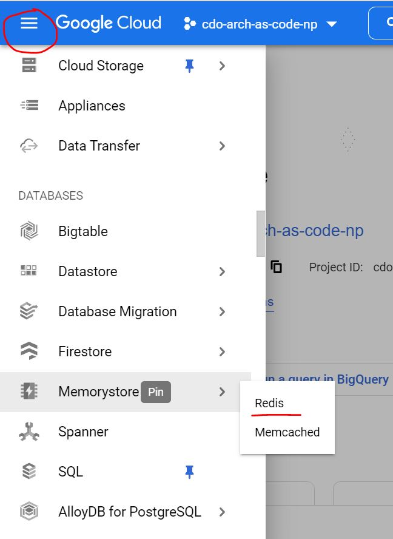
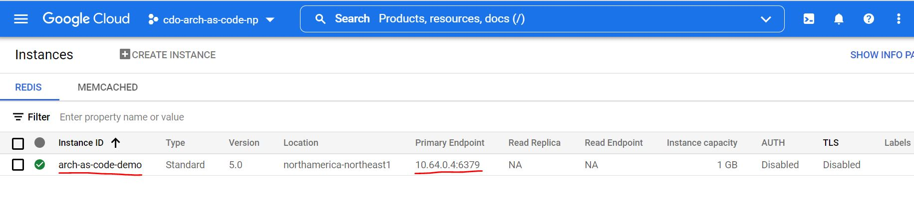

# GCP Memorystore for Redis

Memorystore for Redis provides a fully-managed service for fast data access and easy scaling of underlying Redis instances - more information about Memorystore can be found
[here](https://cloud.google.com/memorystore/docs/redis/redis-overview).
Note that this sample application relies on a running Redis server to function properly:
- For local development, you must run a local Redis server
- For deployment onto GKE, you must provision a Redis instance in Memorystore for your GCP project

## Running a Redis Server for Local Development
First, [install Redis](https://redis.io/docs/getting-started/installation/) on your machine. Open a terminal and use the following command to run the server:

    redis-server

By default, the server listens on port `6379`. Open another terminal and confirm that you can reach the server with these commands:

    redis-cli

    # Given that the connection opens, you should be able to send a PING command
    127.0.0.1:6379> PING

    # And receive a PONG response
    PONG
    
    # Then exit the client
    127.0.0.1:6379> exit

The sample application's Redis host and port values must now be set - these are found in [application.properties](../src/main/resources/application.properties) for Java or in
the [.env](../app/.env) file for NodeJS. Set the host to `127.0.0.1` (i.e. localhost) and the port to `6379`. You may continue
[setting up your local environment](../README.md#select-your-development-environment) - keep the server running for as long as you need to run the sample application.

## Provisioning a Redis Instance on GCP
A sample terraform script for creating the Redis instance can be found in [memorystore-redis.tf](../terraform/memorystore-redis.tf). **Before applying this terraform file, it is advised that you update `maxmemory-policy` with an appropriate eviction policy for your application.**
This setting determines Redis' behaviour when the cache hits the memory limit; refer to [this document](https://redis.io/docs/reference/eviction/) for more information.

Once the file has been updated, follow
[these instructions](https://simplify.telus.com/docs/developer-docs/docs/topics/applying-terraform-configuration-in-gcp-6e4wBLR5Je9aP5Vd8y70vA.md) to apply the terraform configuration to your GCP project.
To confirm that your instance has been created, login to your project through the GCP console. Go to **Navigation Menu > Memorystore > Redis** to view your current instances.

Confirm that an instance is created with the name specified in the terraform file, and make note of the **Primary Endpoint** address. The sample application's Redis host and
port values must match this address - these can be adjusted in [application.properties](../src/main/resources/application.properties) for Java or in the [.env](../app/.env)
file for NodeJS. In the example below, `10.64.0.4` is the host value and `6379` is the port value.

With the Redis instance created and the application configured, you are ready to [deploy your application](../README.md#including-cicd-for-your-api)!