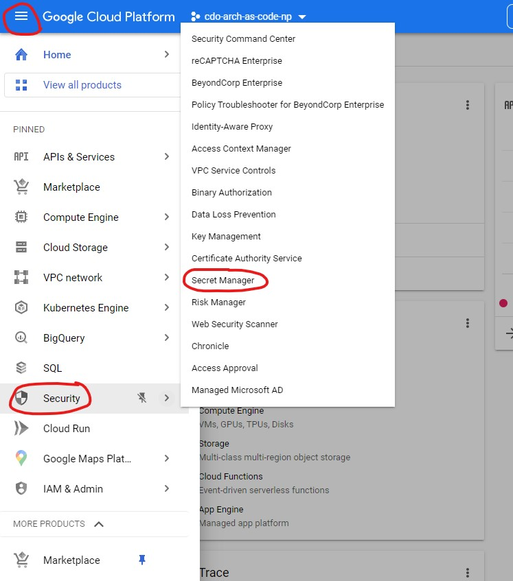

# **Secret Manager**

Secret Manager is a secure and convenient storage system for API keys, passwords, certificates, and other sensitive data. Secret Manager provides a central place and single source of truth to manage, access, and audit secrets across Google Cloud.

  

Teams should **NOT** store any sensitive data in any file especially on GitHub. As teams across TELUS will have access to repos, it's recommended to use GCP Secret Manager to store any sensitive data such as certs, API Keys, passwords required by the application.

  

You can find additional details about [Secret Manager features here](https://cloud.google.com/secret-manager).

  

# **Setup for Secret Manager Access Demo**

  

The sample application requires a pre-configured secret to demonstrate secret resolution, and thus will not run properly if that secret has not been created yet.

This document will guide you through the secret creation process on GCP. You can access the Secret Manager through the GCP console for your project - under **Navigation Menu > Security > Secret Manager**.

  

  

Create a new secret by clicking the **Create Secret** button. This demo in particular requires two secrets with:

- The secret name that matches the secretUserKey or secretKeyName defined in postgresql configuration of your cookiecutter.yaml

- Any string for the secret value

  

  

Now you are ready to [run the application!](../README.md#try-the-sample-application)