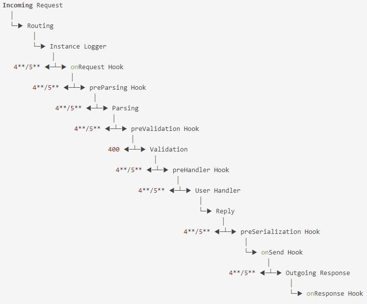

# Request & Response Lifecycle with Fastify

The internal lifecycle of a request in Fastify can be extended upon by using hooks that allow you to listen to specific events in the request/response lifecycle. Hooks are registered with the ``fastify.addHook`` method and allow you to listen to specific events in the application or request/response lifecycle. You have to register a hook before the event is triggered, otherwise, the event is lost.

Read more about Fastify Lifecycle [here](https://www.fastify.io/docs/latest/Reference/Lifecycle/)

 ## Implementation
In this application, the separation between request handling, business logic, and response handling is demonstrated through the use of hooks and controllers. Within the route file [routes/birthday.js](../app/src/routes/birthday.js), hooks are created.

- The ``preValidation`` hook provides access to the request before schema-based validation occurs. Validation of the request can be added here.

- The ``preHandler`` hook provides access to the request before the User Handler creates a reply. Authentication logic can be added here. In this application, we use the preHandler hook to ensure the birth month and day inputs are numbers. If validation fails, we ``hijack`` the reply to prevent Fastify from running any other hooks, running the user handler, and sending responses automatically.

- Inside the controller file [controllers/users/index.js](../app/src/controllers/users/index.js), business logic is implemented. This application calls a Fastify plugin [plugins/calculate-date-diff/index.js](../app/src/plugins/calculate-date-diff/index.js) that is decorated with a function that deals with business logic.

- The ``onSend`` hook provides access to the response and payload before it is sent. In this application, we use the onSend hook to transform the Response payload into a new JSON response

Read more about Fastify Hooks [here](https://www.fastify.io/docs/latest/Reference/Hooks/)

