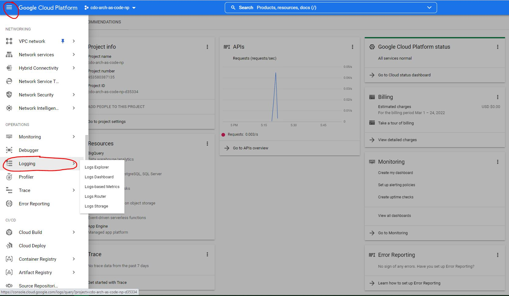
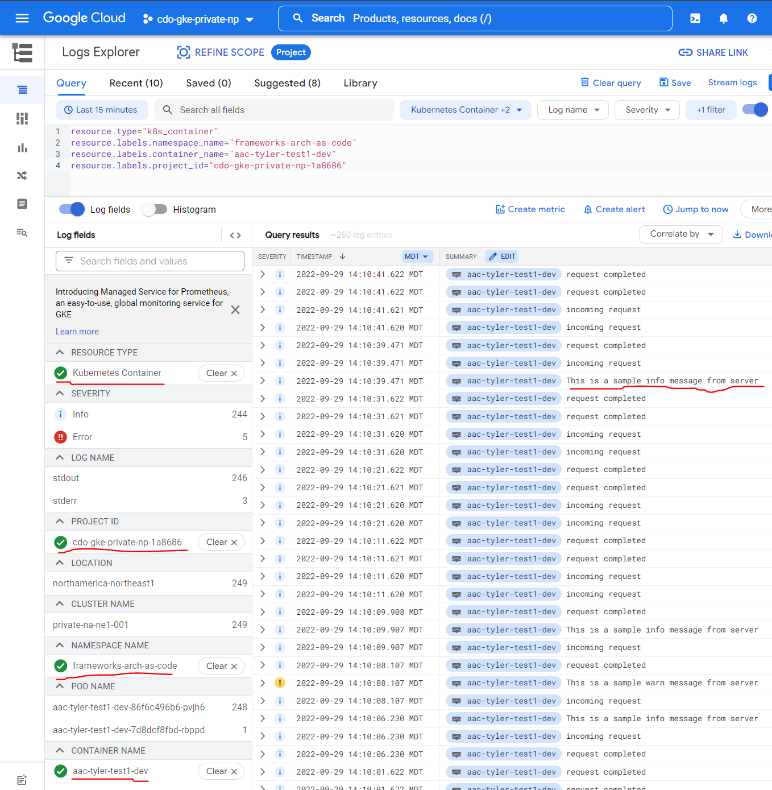
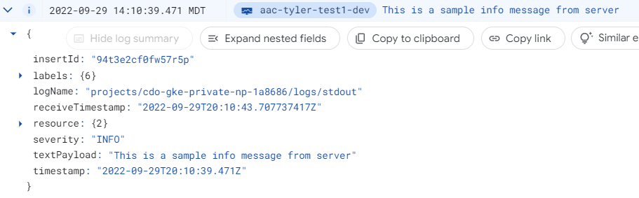

# **Logging**

For implementing logging within your Fastify NodeJS project, the recommended library to use is Pino. It is a logging library with support for
multiple transports. A transport is essentially a storage device for your logs - and each Pino logger can have multiple transports.
Visit [Pino's Github Repository](https://github.com/pinojs/pino) for more information about supported transports, default logging levels, formats, etc.

## **Logging Configurations**

The pre-configured logger can be found in the config file [logger.js](../app/src/logger.js):

- For local environments, the logger will print logs to the console by default.
- For non-production environments (on GCP), the logs will be sent to the logging service of your current active GCP project by default.
- For production environments, this functions similarly to non-production environments

## **Finding Log Messages in GCP**

By default, GKE has a logging agent that will forward logs in your cluster to Cloud Logging.

For this example, assume we have sent a INFO message via the sample app webpage. To view the log entry in GCP console, click on the Navigation Menu at the top-left and scroll down to the Logging Service.



By default, the entries are found under the "Kubernetes Container" resource type, with project id set to your project id. You may also find it under the "Info" severity filter. If the log is recent enough, you may be able to find it without any filter.



Expanding the log entry, we see the following fields:



## **Logging Format on Local**
```
{"severity":"info","time":1664398270772,"message":"This is a sample info message from server"}
```
