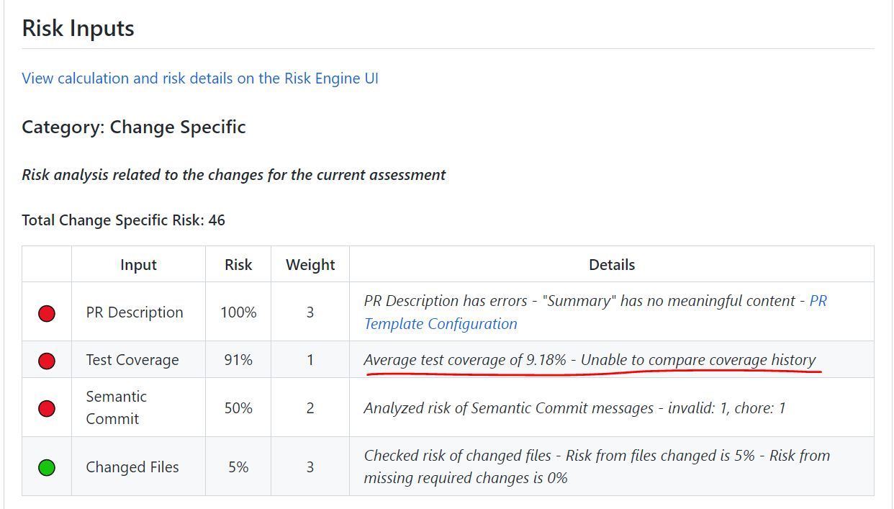

# Risk Engine Quickstart

This starter template includes a [Risk Engine configuration file](../.platform/.riskEngineConfig.yaml) and a [Pull Request Template](../.github/pull_request_template.md).
Full details about the Risk Engine can be found in [this repository](https://github.com/telus/sre-risk-engine).

## Risk Engine Configuration File

The presence of the [Risk Engine configuration file](../.platform/.riskEngineConfig.yaml) under the `.platform` directory will trigger a risk assessment whenever a pull request is created.
A comment will be left by the Risk Engine in the pull request, with a detailed breakdown of the risk assessment criteria and scoring.

The settings in the configuration file define the parameters of a risk assessment - they can be adjusted to suit the specific needs of your application. In particular:
- `riskThreshold` defines the maximum "passing" risk score for a pull request
- Plugins are listed under `riskInputs` which define the risk assessment criteria (i.e. they determine what the Risk Engine will analyze and score)

Visit the [Risk Engine repository](https://github.com/telus/sre-risk-engine) for more information about available plugins, other configuration settings, etc.

## Test Coverage First Steps
> [!IMPORTANT] 
> Please uncomment the following lines in your [.platform/.riskEngineConfig.yaml](../.platform/.riskEngineConfig.yaml) to enable the Risk Engine to analyze the test coverage report prior to assessing a Pull Request. Ensure that the `covReportPath:` matches the path where the coverage report is saved in your repository: 
```
riskInputs:
   - name: testCoverage
     covReportPath: <path to your coverage report file>
     coverageReportType: "jsonSummary"
```


To ensure that the **Test Coverage** input does not error out (like above), you will need to commit a unit test code coverage file to the repository - for Java
this is `jacoco.xml` and for Javascript this is `coverage-summary.json`. The Risk Engine will look for the code coverage file at the path given by `covReportPath` in
the [Risk Engine configuration file](../.platform/.riskEngineConfig.yaml) - edit this path if you wish to upload the coverage file at a different location.

- For Java, Maven can generate the `target/site/jacoco.xml` by running:
```
    mvn test
```
- For Javascript, Jest can generate the `app/coverage/coverage-summary.json` by running:
```
    jest --coverage --coverageReporters="json-summary"
```
- Alternatively, for Fastify, TAP can generate the `app/.tap/report/coverage-summary.json` by running:
```
    tap -R terse <Test File Pattern/Path> --coverage-report=json-summary
```
**Note:** By default, TAP displays a failure message if the code coverage is not at `100%`. The `--no-check-coverage` flag disables this behaviour.

Once the coverage file is uploaded, open a Pull Request on the repository and wait for the Risk Engine Assessment to complete. You should no longer see the error in
the risk assessment results. Note that the Risk Engine will not be able to compare the coverage history on this first Pull Request, the message should disappear on
subsequent Pull Requests.



## Known Issues

- If the code coverage file has not been committed/updated by the developer in a Pull Request, the Risk Engine will run using the existing code coverage file (if any) which will not reflect the newest changes in a branch (or display an error in the Risk Engine results if no such file was found.) The provided code-coverage workflow will autocommit a code coverage file once it is done running, but the Risk Engine will not pick it up until the next scan.

## Pull Request Template

The [Pull Request Template](../.github/pull_request_template.md) is effectively a form that developers will fill out when creating a pull request - this form is
displayed within the pull request description. The template and its validation criteria can be edited to suit the needs of your project. It is also optional and
can be removed from the risk engine assessment by deleting the `prDescription` risk input from the [Risk Engine configuration file](../.platform/.riskEngineConfig.yaml):
```
riskInputs:
  - name: prDescription
    prTemplatePath: ".github/pull_request_template.md"
```