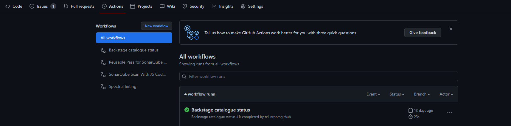

# Backstage Software Catalog

Software Catalog is the basis for Backstage (Simplify). By adding a catalog-info into your repo, your application will be registered automatically in the catalog. This unlocks a lot of features in Backstage that you will be able to take advantage of.

This repo includes a [GitHub Action](../.github/workflows/backstage-catalogue.yml) to automate the process to register your application in the [Software Catalog](https://simplify.telus.com/catalog?filters%5Bkind%5D=component&filters%5Buser%5D=all). See the metadata and tags in [catalog-info.yaml](../catalog-info.yaml).

## Setup
Upon creation of the app repo, the lifecycle is initially set to "testing".

When your application is deployed to a non-production environment, the github action included in your repo will automatically update the lifecycle to "staging". You can see the result of the Github Action in the Actions section.

**Note:** Setting the lifecycle to "production" is intentionally a manual process. Developer has to update the catalog-info.yaml to reflect the appropriate lifecycle: production before or after the service is deployed to the Production environment

