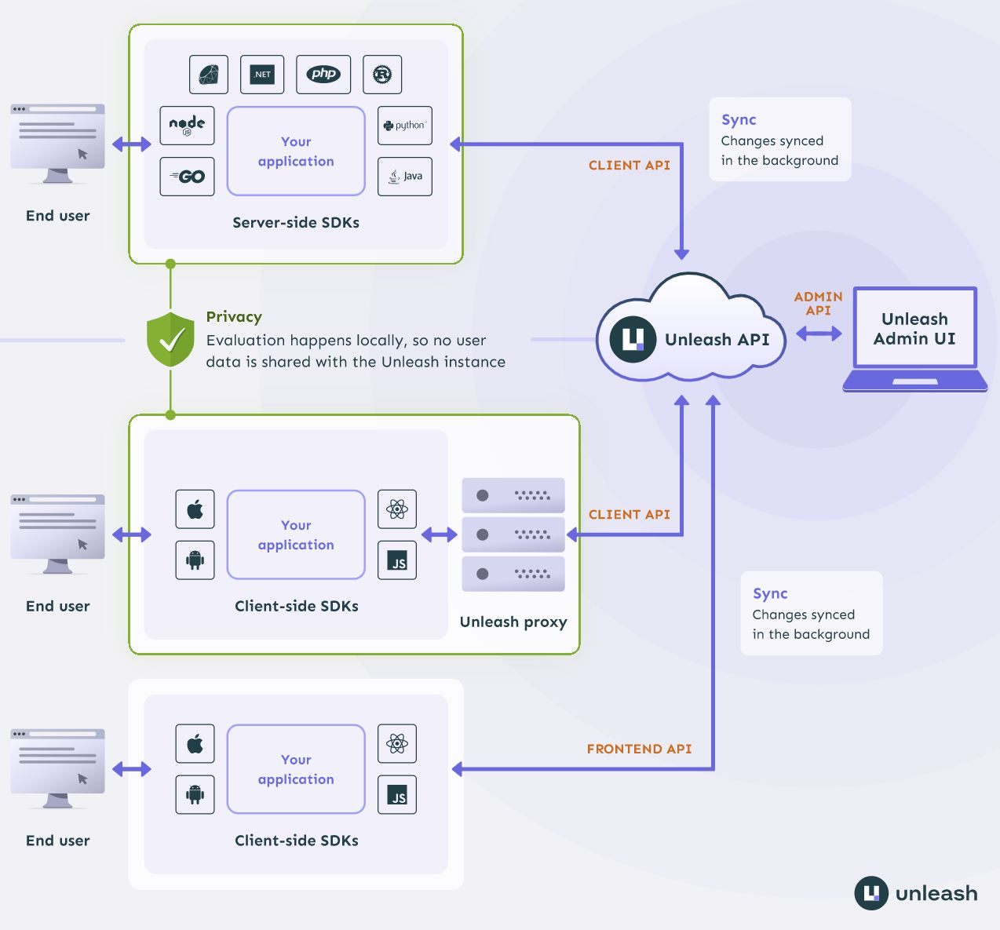
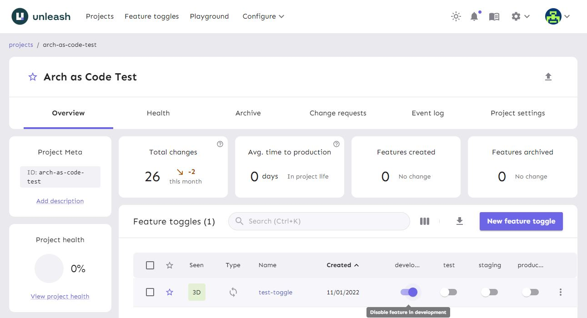

# **Unleash**

Unleash is an open source feature management solution. It improves the workflow of your development team and leads to quicker software delivery. Unleash increases efficiency and gives teams full control of how and when they enable new functionality for end users. Unleash lets teams ship code to production in smaller releases whenever they want.

Feature toggles make it easy to test how your code works with real production data without the fear that you'll accidentally break your users' experience. It also helps your team work on multiple features in parallel without each maintaining an separate feature branch.

Unleash is the largest open source solution for feature flagging on GitHub. There's 12 official client and server SDKs and 10+ community SDKs available; you can even make your own if you want to. You can use Unleash with any language and any framework.

Visit the [Unleash Docs](https://docs.getunleash.io/) for more information

## **Architecture**
In this demo, the client application connects to the hosted Unleash API utilizing the Unleash Node Client SDK (server-side SDK in the image below). 

Visit the [Node Client SDK](https://github.com/Unleash/unleash-client-node) for more information

## **Unleash Project Onboarding**
We have created an automated Unleash onboarding process within [Simplify](https://simplify.telus.com/create?filters%5Bkind%5D=template&filters%5Buser%5D=all&filters%5Btags%5D=arch-as-code) when using our Unleash Client template. Before automated project onboarding, ensure you have created an Unleash account through [go/accessnow](go/accessnow)

If you want to perform this onboarding process manually, see instructions [here](unleash-manual-onboarding.md).

## **New Unleash Project/Toggle Setup**
After using the automated Unleash onboarding process to create a new project/toggle, your project will be viewable [here](https://us.app.unleash-hosted.com/usff0019/projects). Within your project, you will see your newly created Feature toggle.

Next, you will need to store your project's API access token in GCP secret manager:
1. Within your project, navigate to Project settings -> API access
2. Copy the `CLIENT` token key that has been created for you
3. Store the secret according to the following **[Secret Manager instructions](./secret-setup.md)**
4. Inside `app/.env`, set the `UNLEASH_CLIENT_SECRET_NAME` variable to your secret's name in GCP
5. Please test by fetching your Unleash Toggle status before and after changing the `development` toggle in the [Unleash Admin UI](https://us.app.unleash-hosted.com/usff0019/projects), after a toggle status is changed it may take up to 10 seconds for the change to be reflected in the application.

Now you are ready to [run the application!](../README.md#try-the-sample-application)

Read more about Creating Toggles here
https://docs.getunleash.io/user_guide/create_feature_toggle

Read more about Feature Toggle Types here
https://docs.getunleash.io/advanced/feature_toggle_types

Read more about Activation Strategies here
https://docs.getunleash.io/user_guide/activation_strategy