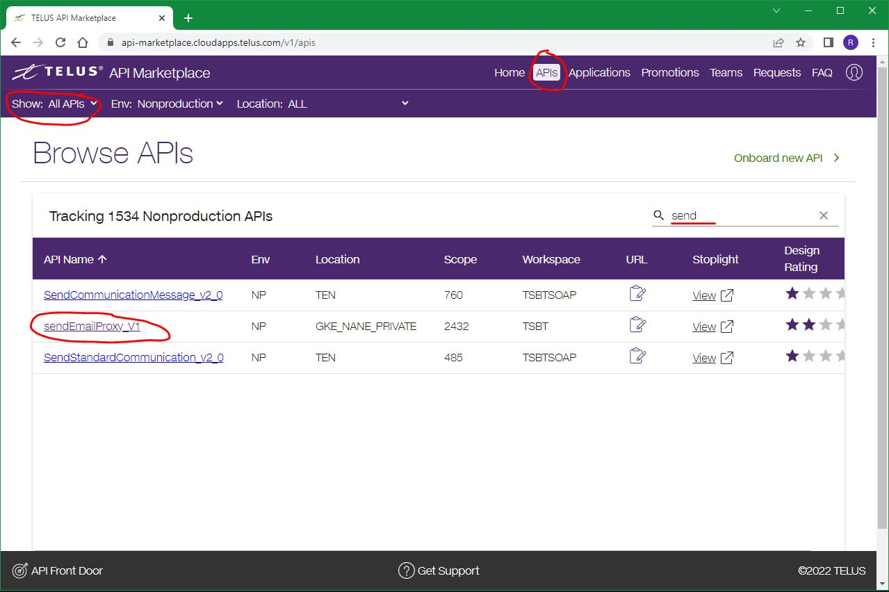
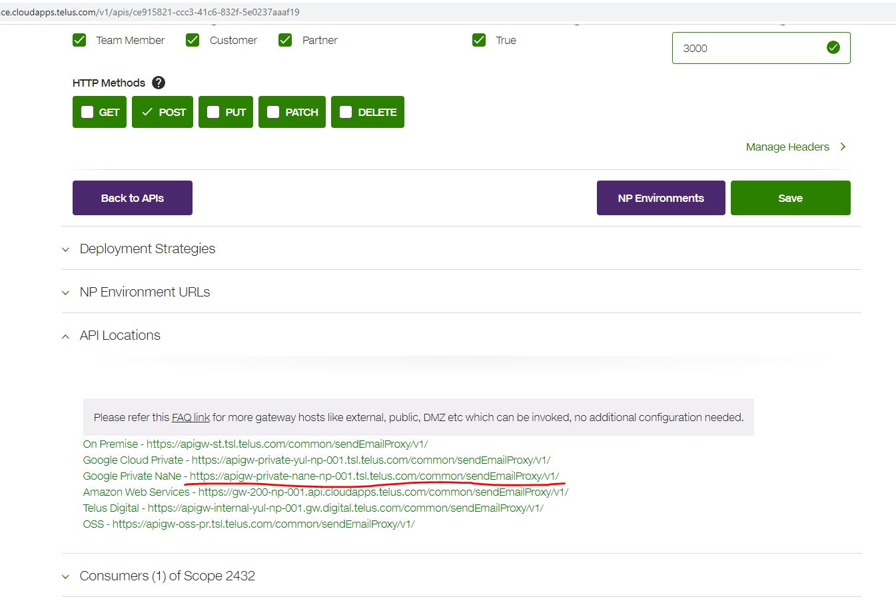
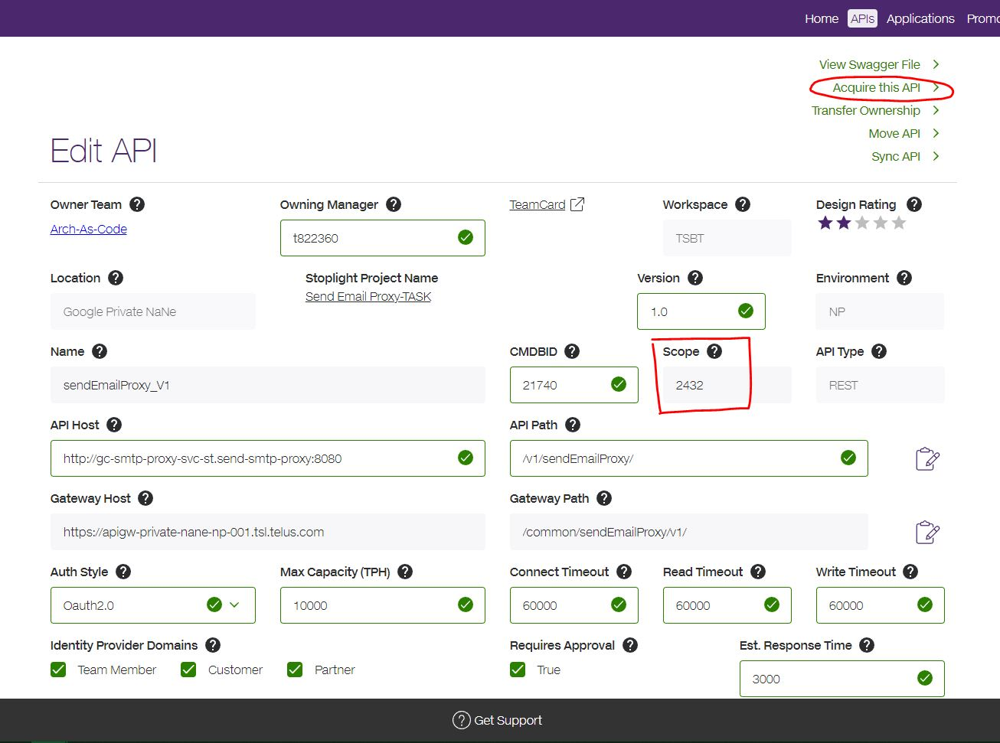
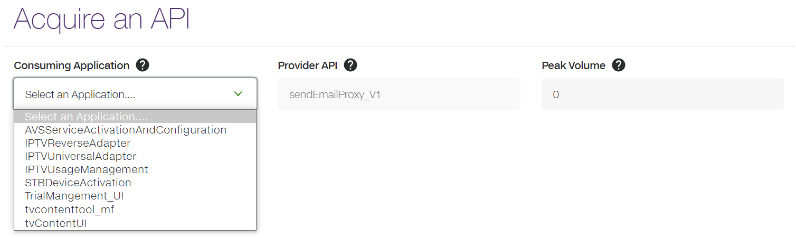
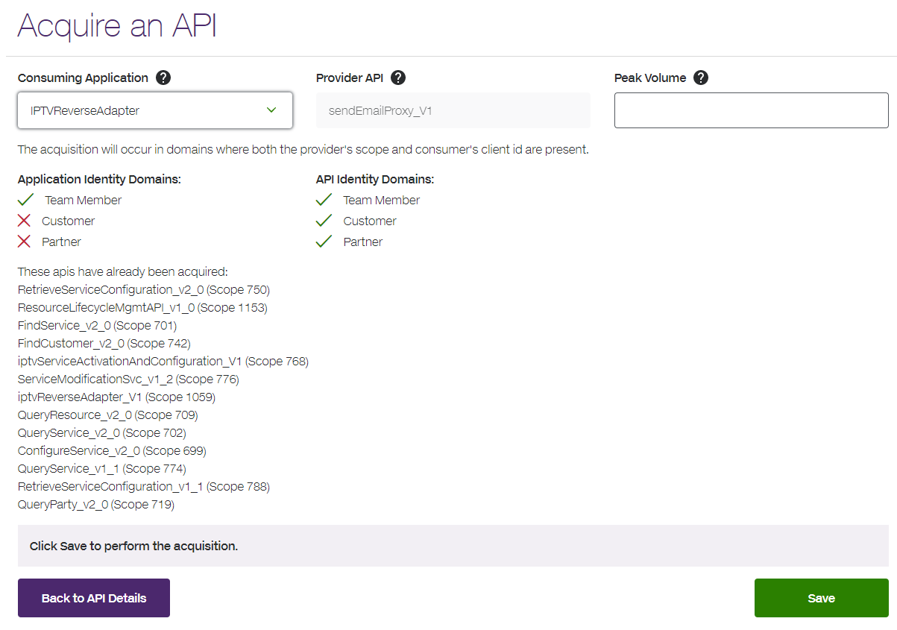
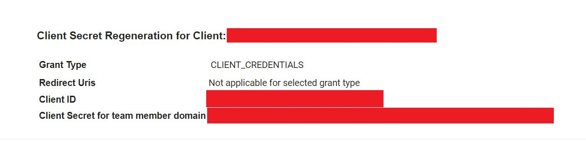

# Calling an API Endpoint (Send Email Example Setup)

This document will guide you through the configuration process for calling an API endpoint on an email proxy service. If you are using this sample application as a
starting point to call your own APIs, then you can still follow along with the guide as an example.

## Acquire the API

In order to call the email proxy service (or some other target service), you must first acquire the API. Open your web browser and navigate to the API Marketplace
(at [go/dev](https://go/dev) or https://api-marketplace.cloudapps.telus.com/v1/home). To browse APIs, click **APIs** on the navbar at the top-right and make sure
**Show: All APIs** is selected on the top-left (as in the picture below.) Search for `sendEmailProxy`, and click on the API name.

Open notepad or some other text editor so that you can record certain important links/values. On the API page, copy and paste the **Scope** into notepad - then
scroll towards the bottom of the page and expand the **API Locations** section. Copy and paste the endpoint URL into notepad - for our example, we shall use the
Google Private NaNe URL (https://apigw-private-nane-np-001.tsl.telus.com/common/sendEmailProxy/v1/).

Scroll back towards the top of the page, and click **Acquire this API** at the top-right.

Follow this process if the consuming application has not been on-boarded:
- [Joining an API Marketplace Team](https://simplify.telus.com/docs/default/component/api-marketplace/joining-a-team/)
- [Defining an Application in the API Marketplace](https://simplify.telus.com/docs/default/component/api-marketplace/defining-an-application/)

Choose the consuming application that will use the API.

Set the Peak Volume by requests per hour, and click **Save**. Once approved by the Service Provider, an email will be sent for confirmation. The email should contain the
client secrets of the API.

## Create Secrets (Client ID and Client Secret)

The Client ID and Client Secret above should NOT be used anywhere in the source code. Instead, use the [Secret Manager](secret-setup.md#setup-for-send-email-example)
of your GCP project to store those values. Copy and paste the name of your secrets in your notepad for reuse later (do not use the actual values).

## Set/Review Configuration File Values

The information required to call the API endpoint is stored in a configuration file - in [application.properties](../src/main/resources/application.properties) for Java,
and in [.env](../app/.env) for NodeJS. Make sure the following properties have the correct values:

- **Project ID** - ID of the GCP project containing your client secrets
- **Scope** - Scope of the API, as specified in the API Marketplace
- **Client ID Secret Name** - Name of the secret containing the Client ID
- **Client Secret Name** - Name of the secret containing the Client Secret
- **Token URL** - URL for retrieving the OAuth2 token, as specified [here](https://docs.google.com/document/d/1nm51hwWWhmeZx0dcM1o47Bm4tQ4uymVK5W2zctfhVYg/edit) (for our
example, use https://apigw-st.telus.com/st/token)
- **Endpoint URL** - URL of the API endpoint, as specified in the API Marketplace
