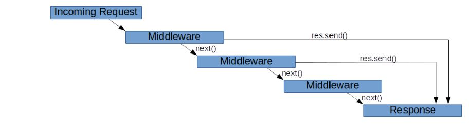

# Request & Response Lifecycle with Express

The internal lifecycle of a request in Express can be extended upon by using middleware, this are functions that have access to the request object (req), the response object (res), and the next middleware function in the application’s request-response cycle. The next middleware function is commonly denoted by a variable named next.

When a request is received by Express, each middleware that matches the request is run in the order it is initialized until there is a terminating action (like a response being sent).

Read more about Express Middleware [here](https://expressjs.com/en/guide/writing-middleware.html)

 ## Implementation
In this application, the separation between request handling, business logic, and response handling is demonstrated through the use of middleware and controllers. Within the middleware folder [middlewares/validate.js](../app/src/middlewares/validate.js),middleware are created.

- The ``fieldsRequired`` middleware is a custom middleware created to avoid empty fields.

- The ``isNumberValidation`` middleware is a custom middleware created to validate if the text is a number.

- Inside the controller file [controllers/birthday.controller.js](../app/src/controllers/birthday.controller.js), business logic is implemented. This application calls a function [utils/calculateDateDiff.js](../app/src/utils/calculateDateDiff.js) that deals with business logic.

- The ``payload`` middleware is a custom middleware provides access to the response and transform the Response payload into a new JSON response.

Read more about middleware modules supported by Express team [here](https://expressjs.com/en/resources/middleware.html)

