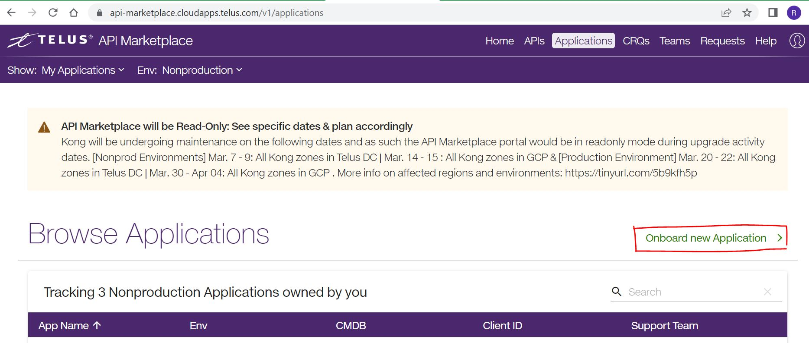
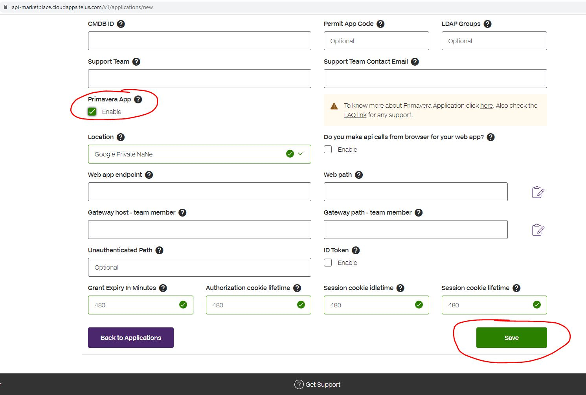

# Onboarding your Application to Kong

This sample application demonstrates how to extract the ID token provided by [Kong Ingress](https://go.telus.com/prima) using the `/names` endpoint. As per the documentation, the ID token is passed in as an HTTP header in the request. More specifically, it is stored as a JSON web token in the `x-id-token` header.

In order for this to work, you must onboard the application to Kong. This involves completing the following steps:
- Deploying the application onto GKE
- Creating a sub-domain for the application
- Onboarding the application in the [API Marketplace](https://go.telus.com/dev)

## Deploying the Application onto GKE

Make sure your application is deployed onto GKE and is working correctly. If you need to add a CI/CD pipeline for deployment, consider using [EP's CI/CD generator on Simplify](https://simplify.telus.com/create/templates/default/ep-generators). Note the name of your GKE workload and the namespace used to deploy the application, these will be used in a later step.

## Creating a Web Application Subdomain

[The full documentation is linked here](https://docs.google.com/document/d/10iaBcgpt06uIqvgHwxUHDKHFScmT8T5gJFRH2SuJxXs/edit#heading=h.367lbr381jid)

To create a subdomain for your web application under `cloudapps.telus.com`, you will need to add a terraform module into [this repository](https://github.com/telus/cio-cloudapps-dns) through a Pull Request (check the **Sample Entry** section in the README for clarification.) A sample terraform file has been generated [here](../terraform/dns-entry.tf), though you may need to change the `name` property to follow proper naming guidelines (for example, do not include suffixes such as `-ui`, `-sample`, `-java`, etc.)
- Confirm the correct `module.*` reference is used in the `cname`. The [Established A Records](https://github.com/telus/cio-cloudapps-dns#established-a-records) section lists all the Terraform references and the associated ingress - make sure the reference you use corresponds to an ingress that reaches your application.
- The `name` property is the subdomain name for your application. So if we have `name = example-name`, then this corresponds to the host `https://example-name.cloudapps.telus.com` (which you will use as the **Gateway Host** in the API Marketplace later.)
- Once the Pull Request is merged in, you will have to wait until the terraforms are applied before your subdomain is created.

## Onboarding the Application in the API Marketplace

First go to the home page of the [API Marketplace (go/dev)](https://go.telus.com/dev) and click on the **Applications** tab in the top-right. Click **Onboard new Application**, as shown below:

When the onboarding page is loaded, fill out the required fields - then under **Primavera App**, select **Enable**. Another section will pop up: 

- **Web app endpoint** refers to the location of your deployed workload; it should take the form: `http://<workload name>.<namespace>:<port>`
- **Web path** is the endpoint in your application that you would like to hit when accessing through the gateway (for the sample endpoint, this should be `/names`)
- **Gateway host** refers to the `cloudapps.telus.com` subdomain you created [at this step](#creating-a-web-application-sub-domain)
- **Gateway path** is the base path that will be used for routing in the API gateway. It will be combined with the Gateway Host to be considered as the full URL

After filling all the required fields on the page, click the **Save** button (it may take a few minutes for the change to persist.) Once the settings are saved, navigate back to your application in the API Marketplace and expand the **Redirect URIs** section. Copy the link into your browser (while on VPN) and sign in using your credentials - you should see your first and last name displayed on the web page.