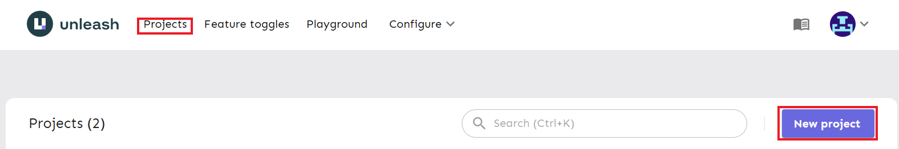
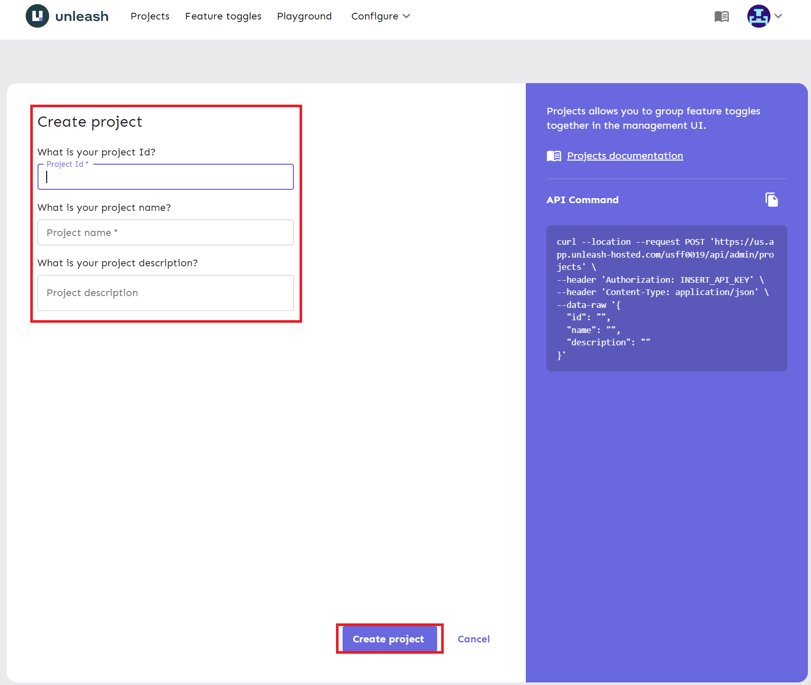
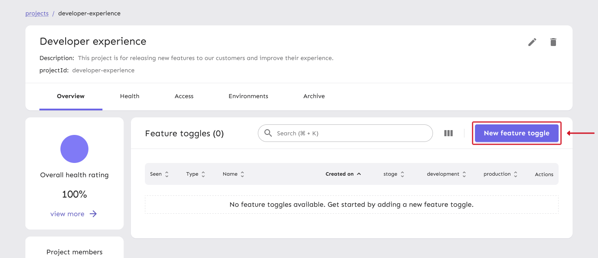
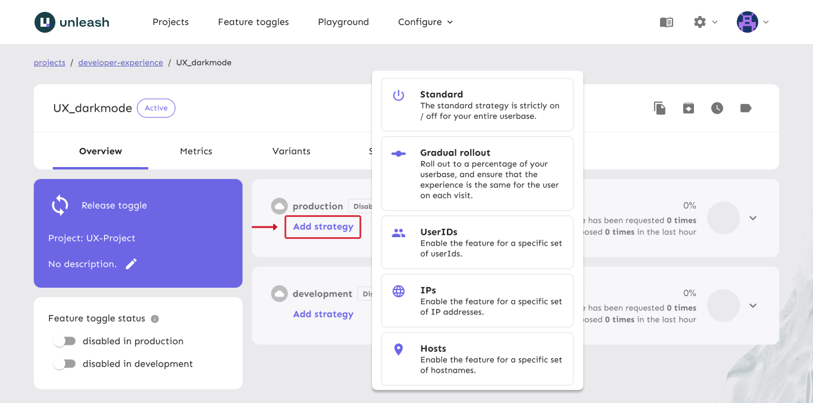
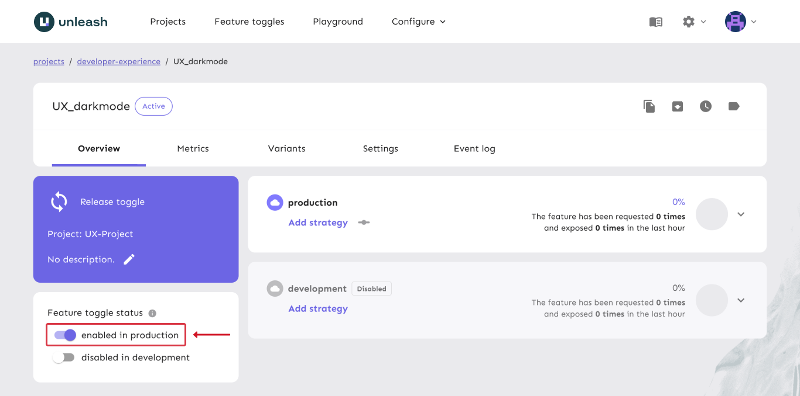
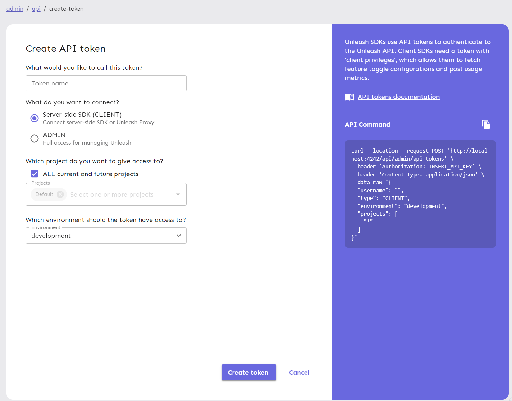

# **Unleash Project Manual Onboarding**
To use Unleash in a new project, a user with the Editor role will have to use the hosted Unleash site to create a new project. 

1. On your hosted or self-hosted Unleash site, click New project on the Projects page

2. Enter a project id and project name for your new project and click Create project

## **Creating a Standard Toggle Through the Admin UI**

1. On your hosted or self-hosted Unleash site, select a project and click New feature toggle

2. Click Add strategy and select a strategy for the toggle
Standard is a simple on/off toggle for all users

3. Enable or disable the toggle in the bottom left for your desired environment

Read more about Creating Toggles here
https://docs.getunleash.io/user_guide/create_feature_toggle

Read more about Feature Toggle Types here
https://docs.getunleash.io/advanced/feature_toggle_types

Read more about Activation Strategies here
https://docs.getunleash.io/user_guide/activation_strategy

## **Creating a Client API Token**
To use Unleash in your project through an Unleash Client SDK (this template) or Unleash proxy, you will need a Client API token. This can be created by an Unleash user with the Admin role.

1. Navigate to your project in Unleash

2. Click Project settings

3. Click API access

4. Click New API token

5. Input a Token name and select CLIENT for the token

6. Select the environment for the token and click Create token

7. Store this using **[Secret Manager](./secret-setup.md)**
