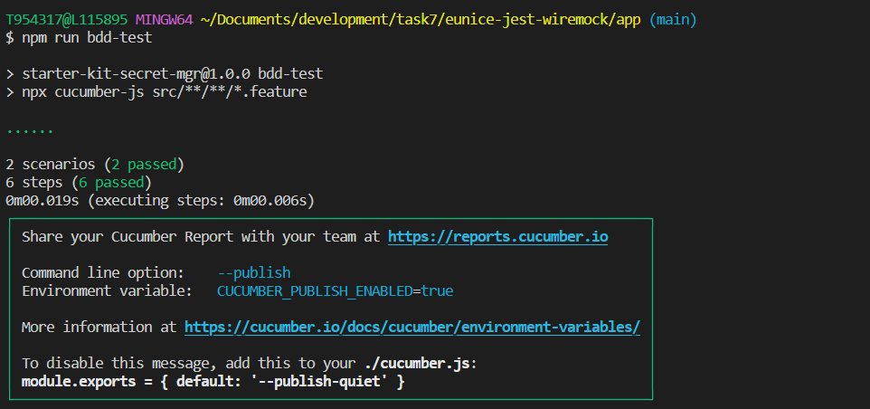
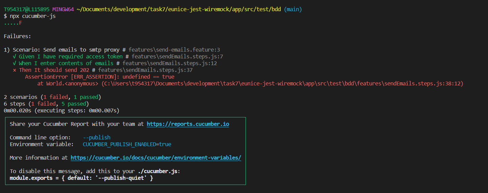

# **BDD Testing** 

This sample application includes a demo integration test run with the [Cucumber framework](https://github.com/cucumber/cucumber-js). The application endpoint called by
the test depends on another backend service, whose API is mocked by a Wiremock server. The token retrieval endpoint is also mocked by Wiremock.

To run the integration tests locally:
- In your terminal, `cd` into your `app` directory (which contains the `wiremock/` directory)
- Run `docker compose up -d` to start the wiremock server (which will load the configurations in the `wiremock/` directory)
- Now the mocked API endpoint is available on `localhost:8085`
- Switch back to `app` directory, run `npm run bdd-test` to run the BDD tests suites. 

To see how this runs in a github action, refer to [this workflow file](../.github/workflows/code-coverage-nodejs.yml).

## **Cucumber Configuration**
In this sample application, the `.feature` [files](../app/src/tests/features/get-token.feature) define the bdd test scenarios, which would follow the steps defined in the `.steps.ts` [files](../app/src/tests/features/getToken.steps.ts).
Note that Cucumber cannot natively interpret steps written in TypeScript, therfore it must be configured to use `ts-node/register` in the [cucumber.js](../app/cucumber.js)
configuration file.
Below is a screenshot of an example run of the BDD test cases:

Failed steps would be indicated in **red**.

## **Wiremock Server Configuration**
The `wiremock/` directory provides an example configuration for a wiremock server, to be run in a docker container. Since the sample application runs on port 8080
by default, the docker container should listen on a different port (the example above uses 8085.) The JSON files in the `mappings/` directory
determine the endpoints to be mocked, and the JSON files under `__files` serve as responses to be returned by the mocked endpoints. You may also directly
set the response in the mapping using the `response.jsonBody` property.