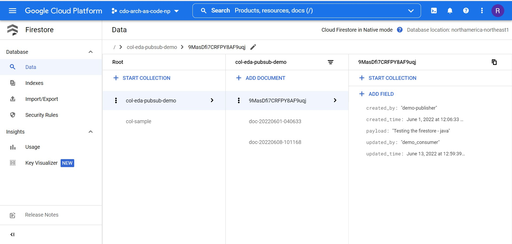

# Google Cloud Firestore

Cloud Firestore is a flexible, scalable NoSQL database on Google Cloud Platform. Unlike a SQL database, there are no tables or rows. Instead data stored in documents, which are organized into collections:
- Documents (middle column) are the unit of storage in Firestore - each document contains fields (right column) which are key-value pairs that hold data (such as a string, date, number, boolean, etc.) In this sense, documents are very similar to JSON objects. They do not have a schema, so different documents can store different fields with different types. However it is best to use the same fields and data types across multiple documents, so that it is easier to query them.
- Collections (left column) are containers for documents - they cannot contain other collections or any raw values. Furthermore, collections are not "created" or "deleted" in the usual sense. After you create the first document in a collection, the collection automatically exists. If you delete all of the documents in a collection, then it no longer exists. Documents within the same collection must have unique ids.

