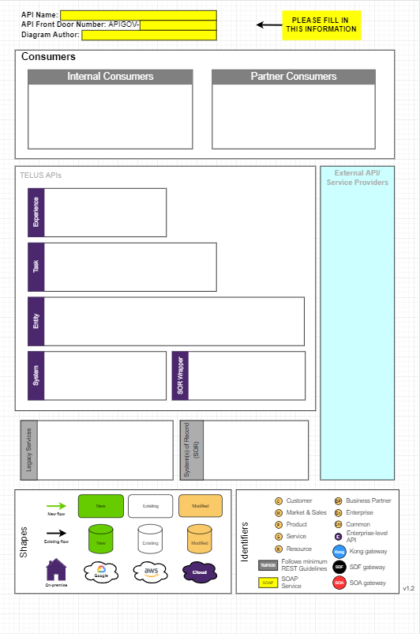

# **API Documentation Template** 

[*API-Context-Diagram-v2022*](https://developers.telus.com/topics/creating-an-api-context-diagram)

## Contact Information 
Complete the table below with Name & TELUS E-mail address for the given roles:

|Role | Name | TELUS E-mail
|--|---------|--|
|Architect |  | 
|Product Owner | | 
|Developer Team|  | 
|Support Team|  |

#### Example:

|Role | Name | TELUS E-mail
|--|---------|--|
|Architect | Alice Smith | alice.smith@telus.com
|Product Owner | Bob Smith| bob.smith@telus.com
|Developer Team| Charlie Smith| charlie.smith@telus.com
|Support Team| David Smith| david.smith@telus.com

## Postman Collection
Update with the API's Postman Collection (or URL to access) for use in review or execution of the API's requests and  responses. 

> Examples of a Postman Collection for TM Forum Open APIs are available [here](https://projects.tmforum.org/wiki/display/API/Open+API+Table).

## Sample Implementation Code
Update with any available Sample Implementation Code for the API (or URL to access) for use in review or execution of the API's requests and  responses. 

> Examples of Sample Implementation Code for TM Forum Open APIs are available [here](https://projects.tmforum.org/wiki/display/API/Open+API+Table).

## Capability, Feature or Story 
Update with the API's Capability, Feature or Story (or URL to access).
> Examples are available [here](https://projects.tmforum.org/wiki/display/API/Open+API+Table) - refer to section "Introduction" for any TM Forum Open API User Guide.

## Sample Use Cases
Update with the API's sample use cases.
> Examples are available [here](https://projects.tmforum.org/wiki/display/API/Open+API+Table) - refer to section "Sample Use Cases" for any TM Forum Open API User Guide.

## API Category
List patterns applied for choosing the API Category 
> API Category  can be referenced from  [here](https://developers.telus.com/guides/understanding-the-api-architecture/what-are-the-api-categories).
> API Architecture patterns can be referenced from  [here](https://developers.telus.com/guides/understanding-the-api-architecture).

## API Context Diagram
Update with the API's Context Diagram (or URL).
> Help to create an API Context Diagram can be referenced from  [here](https://developers.telus.com/topics/creating-an-api-context-diagram).

## API Design Interface
### Operations, Paths, Parameters, Request & Responses, Resources
- Update with:
  - A link to your swagger / *.OAS3 model, following update of description properties for each component
  - (Situational & subject to change) Instructions to view based on design tooling documentation used:
	  - Stoplight: Link the swagger / *.OAS3 model, following update of description properties for each component, to a 'Documentation.hub' file
		  - example at [go/stoplight/dochub](https://telus-next.stoplight.io/sandbox/tsbt-sample-api/version%2F1.1/Documentation.hub.yml?edit=%2Fpages%2F~1%2Fdata%2Fchildren%2F6)
	  - Postman: Generate documentation ([instructions](https://learning.postman.com/docs/publishing-your-api/documenting-your-api/#generating-api-documentation) to be verified following rollout of Postman Enterprise), following update of description properties for each component.

 
## Target API Specification
####  Complete the table below:
|Release| Date | API Name | Version | TMF Open API Specification & Id 
|--|---------|--|--|--|
|Current|  |  | | 
|Target |  |  | | 

####  Example: 
|Release| Date | API Name | Version | TMF Open API Specification & Id 
|--|---------|--|--|--|
|Current| 2022-03-25 | casaProductOrder |1.0 | ProductOrdering TMF 622
|Target | 2023-03-25 | casaProductOrder |2.0 | ProductOrdering TMF 622

>Examples of TM Forum Open API Specifications are available [here](https://projects.tmforum.org/wiki/display/API/Open+API+Table).
>
>TELUS Repository of TM Forum Open API Specifications are available [here](https://telus-next.stoplight.io/tsbt/tmf-open-api-repository-for-reference-only).
>
>TM Forum GitHub of Open API Specifications is available [here](https://projects.tmforum.org/wiki/display/API/Open+API+Table).
>
>Simplify Hub Documentation of TM Forum Open API is [here](https://developers.telus.com/guides/understanding-the-api-architecture/what-are-the-tmf-open-apis).

## Aligning your API to a TMF Open API 
- ### Base Schema Extensions 
	 - Applies when modelling the API to a TMF  Open API specification
	 - Complete the table below noting any of your API's Extensions or use of Models from 
other designs:

| TMF Open API | TMF Open API Base Schema |Schema Extension  
|--|--| --
|| |  
|| | 
|| |

#### Example:
| TMF Open API | TMF Open API Base Schema |Schema Extension
|--|--| --
|productOrdering| Place | geoLocation  
||  | 

> TELUS Repository of TM Forum Open API Specifications, with their base schemas, are available [here](https://telus-next.stoplight.io/tsbt/tmf-open-api-repository-for-reference-only).
> API Documentation for Extension Patterns to TM Forum Open API Specifications is available in [Simplify Hub.](https://developers.telus.com/topics/applying-tmf-open-apis) 

- ### Schema Models from other API Designs
 

	 - Applies when modelling the API to a TMF  Open API specification
	 - Complete the table below noting any of your API's Extensions or use of Models from 
other designs:

| TMF Open API | Referenced TMF Open API | Referenced TMF Open API Schema 
|--|--| --
|| |  
||  | 

#### Example:
| TMF Open API | Referenced TMF Open API | Referenced TMF Open API Schema 
|--|--|--|
| Resource Inventory - TMF 639|  Resource Catalog - TMF 634 | LogicalResourceSpecification | 

## Resource Model
Update with the API's Resource Model (or URL to access).

> Examples are available [here](https://projects.tmforum.org/wiki/display/API/Open+API+Table) - refer to section "Resource Model" for any TM Forum Open API User Guide.

> Your API's Resource Model may be able to be generated using tooling [here](http://apitools.tsl.telus.com/apitools/swagger-analyzer.php) - select option `Generate Schema Diagram.`

## API Roadmap
Update with the API's Roadmap (or URL).

## API Architecture Patterns Applied
List patterns applied to the API Design.
> API Architecture patterns can be referenced from  [here](https://developers.telus.com/guides/understanding-the-api-architecture).

##  API Gateway 
- Non-production:
- Production:

## Security Model
Update with the API's Security Model.

> The TELUS standard model for API security can be referenced from  [here](https://developers.telus.com/guides/consuming-apis-from-an-end-user-facing-application?single-page=true).

## Notification Resource Model
Update with the API's Notification Resource Model (or URL to access). Notification resources are also referred to as 'events'. 

> References for Event Driven Architecture is available at [Simplify Hub](https://developers.telus.com/topics/what-is-event-driven-architecture)
> Examples are available [here](https://projects.tmforum.org/wiki/display/API/Open+API+Table) - refer to section "Notification Resource Model" for any TM Forum Open API User Guide.

## Lifecycle 

 - Update with the API's Lifecycle for its Resources that have state
   transitions. 
   - A sequence diagram or state transition diagram can also
   be used.

> Examples are available [here](https://projects.tmforum.org/wiki/display/API/Open+API+Table) - refer to section "Lifecycle" for any TM Forum Open API User Guide.

## Reading List
Update with any additional references or links helpful for your API Documentation audience.

