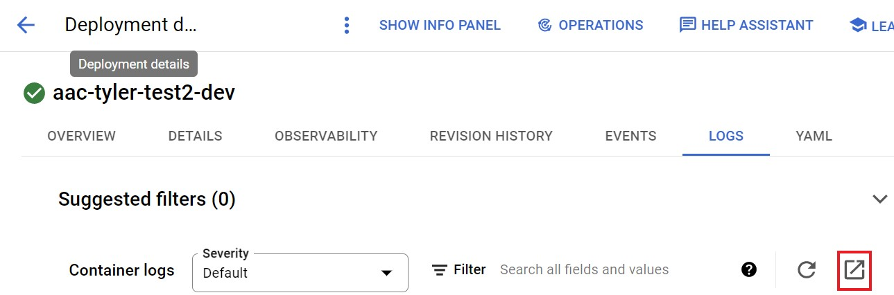
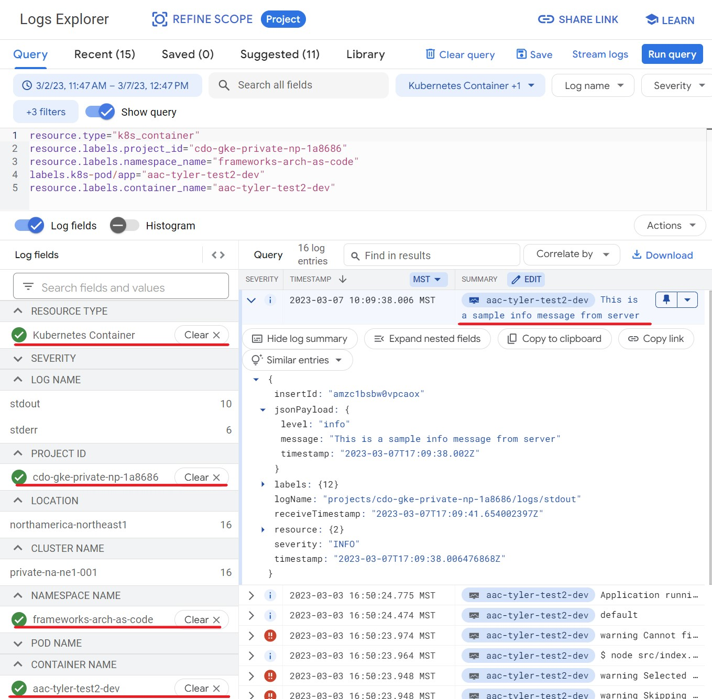

# **Logging**

For implementing logging within your NodeJS project, the recommended library to use is Winston. It is a simple, universal logging library with support for
multiple transports. A transport is essentially a storage device for your logs - and each winston logger can have multiple transports.
Visit [Winston's Github Repository](https://github.com/winstonjs/winston) for more information about supported transports, default logging levels, formats, etc.

## **Logging Configurations**

The pre-configured logger of each environment can be found in the sample config files:
- For local environments, the associated config file is [default.ts](../app/src/config/default.ts). By default, the logger will print logs to the console.
- For non-production environments (on GCP), the associated config file is [dev.ts](../app/src/config/dev.ts). By default, the logs will be sent to the logging
service of your current active GCP project.
- For production environments, the associated config file is [pr.ts](../app/src/config/pr.ts). This functions similarly to non-production environments though it
is reserved for production-specific configurations.

## **Finding Log Messages in GCP**

Google’s Cloud Logging will be our centralized logging platform. To send log messages to Google Cloud:

- If you are running in a Kubernetes Engine, App Engine, GCE, Cloud Run, Cloud Functions, then logs to STDOUT or STDERR are automatically sent to Cloud Logging.

- If you are running outside of Google Cloud runtime environment, e.g., from on-premise datacenter, or another cloud, you can:
  - Use the Cloud Logging API to send log entries to Cloud Logging
  - Use a Logging Agent
  - Use a Fluentd adapter

For this sample, assume we have sent an INFO message via a sample app that is deployed on GKE. To view the log entry in GCP console, click on the Navigation Menu at the top-left and scroll down to the Logging Service.


From this page, you can filter the logs to find your deployed workload. An easy way to filter for your deployed workload is by clicking the square icon with an arrow on the "LOGS" page of your GKE workload.



Alternatively, you can filter for you workload based on the following fields:
- Resource Type: `Kubernetes Container` 
- Project ID: `<GKE Project ID>` 
- Namespace Name: `<namespace name>`
- Pod Name: `<your pod name>`

If the log is recent enough, you may be able to find it without any filter.



## **Logging Format on Local**

```
{"level":"info","message":"This is a sample warn message from server","timestamp":"2022-04-22T16:46:55.264Z"}
```

Note that timestamps are in RFC3339 UTC "Zulu" format.
