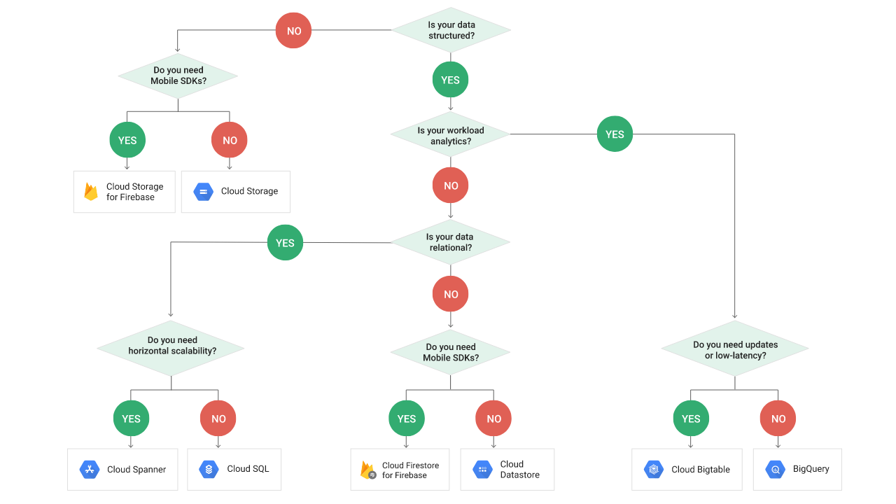

# **Local File dependency**

## **Considerations when using Cloud Storage**

When preparing to migrate an application to the cloud, it's important that there are no local file dependency. The application will need to be refactored to remove any local file system dependency to use Google Cloud Storage. 

This will prevent the ability of the application to be easily containerized and scaled. 

Team should consider the following storage options:

- Cloud Storage
- Cloud Spanner
- Cloud SQL
- Cloud Datastore
- Cloud Bigtable
- BigQuery
		
The decision tree from Google below helps teams identify the ideal storage solution for their needs. In most cases, Cloud SQL will address a team's requirements for structured data. 

Google Cloud Storage is intended for Binary or Object data.

*If based on your application requirements, you are  still required to implement localized storage, then you will need to refactor the application to use Cloud Storage buckets.*

Some valid use cases for Cloud Storage buckets:
- Specific format for integration with vendors (generation of CSV file to FTP to vendor)
- Unstructured data
- Images or Media formats that can't be converted into a standard data storage
- Backups