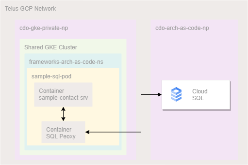

# **Cloud SQL**

This Starter Template provides a sample implementation for simple CRUD operations against Cloud SQL [PostgreSQL or MySQL] database. The sample implementation consists of a simple web interface service hosted on GKE accessing the PostgreSQL or MySQL in Cloud SQL in a GCP project. The main purpose of this template is to provide a guideline for developing data driven application / services hosted on GKE.

> [!IMPORTANT] 
> If you choose to use MySQL, please refer to the MySQL documentation for Terraform configuration and update the `package.json` file accordingly to include MySQL dependencies. Please also remember to update database config to include mysql client in [connect-tcp.js](../app/src/utils/connect-tcp.js).

Teams should **NOT** store any sensitive data in any file especially on GitHub. As teams across TELUS will have access to repos, it's recommended to use GCP Secret Manager to store any sensitive data such as certs, API Keys, passwords required by the application.

You can find additional details about [Cloud SQL features here](https://cloud.google.com/sql).
 
# Prerequisites
Before you begin, the following tasks must be completed:

1. Provision a Workload Identity account for accessing Cloud SQL.
2. Create a KSA (Kubernetes Service Account) to be mapped to your Workload Identity Account
3. Provision Cloud SQL for PostgreSQL or MySQL in your GCP Project. If you choose MySQL, please refer to the MySQL documentation and update Terraform configuration.
4. Setup CI/CD Pipeline for your GitHub repository.
5. Include the Cloud SQL Proxy sidecar in your CI/CD helm chart.
6. Test the connection to Cloud SQL from your GKE Deployment.
7. (and 8) Create the sample 'contacts' table for testing with the sample application.


For steps 1 and 2, refer to this tutorial video on how to
[Provision GCP Resources using Terraform](https://drive.google.com/file/d/1W0vaGDTZoZqCNUXHFZnekFY89rmcnqOY/view?usp=sharing)

## 1- Provision a Workload Identity account for accessing Cloud SQL

The following sample Terraform script will create a workload identity account to be used for accessing the Cloud SQL instance from GKE (North America-North East Cluster):
```
module "cloudsql-sa-workload-identity" {
  source      = "git::ssh://git@github.com/telus/tf-module-gcp-workload-identity?ref=v0.0.4"  
  gsa-name    = "cloudsql-gsa"  
  ksa-name    = "cloudsql-ksa"  
  namespace   = var.gke_namespace  
  project_id  = var.project_id  
  roles       = ["roles/cloudsql.client", "roles/cloudsql.instanceUser", "roles/cloudsql.editor"]  
  cluster_env = "private-nane-${var.env}"
}
```

## 2- Create a KSA (Kubernetes Service Account) to be mapped to your Workload Identity Account
Follow the instructions provided [here](https://github.com/telus/tf-infra-cdo-horizon/tree/docs/docs/cloudsql#connecting-to-your-cloudsql-instance-from-gke-electric_plug) to setup your KSA account.

## 3- Provision Cloud SQL for PostgreSQL in your GCP Project.

If you don't already have Cloud SQL for PostgreSQL provisioned in your GCP project, you can use the following Terraform module to create the instance:
```
resource "random_id" "db_name_suffix" {
	  byte_length = 4
}

variable "instance_suffix" {
  type    = string
  default = "db"
}	
variable "db_name" {
  type    = string
  default = "APPDB"
}
variable "db_user" {
  type    = string
  default = "postgres"
}
variable "db_version" {
  type    = string
  default = "POSTGRES_14" // "MYSQL_8_0" for MySQL
}
variable "shared_vpc_network" {
  description = "the host network for the database"
  default     = "projects/cdo-cloud-vpc-host-np-d48ee6/global/networks/cloud-svc-network-np"
}

// =================================================
module "cloudsql" {
	  # When using  these modules in your own templates, you will need to use a Git URL with a ref attribute that pins you
	  # to a specific version of the modules, such as the following example:
	  source          = "git::ssh://git@github.com/telus/tf-module-gcp-cloudsql.git?ref=v1.3.0"
	  project_id      = var.project_id
	  region          = var.region
	  db_server_name  = "${var.project_name}-${var.instance_suffix}"
	  db_name         = "${var.db_name}-${random_id.db_name_suffix.hex}"
	  db_version      = var.db_version
	  private_network = var.shared_vpc_network
	  availability_type       = "REGIONAL"
	  backup_start_time       = "06:00"
	  maintenance_window_hour = "8"
	  maintenance_window_day  = "6"
	  database_flags = {
	    "max_connections" : 20
	  }
	}
```
The following Terraform script will create a database user based on the SQL Service account provisioned in step 1:
```
resource "google_sql_user" "arch-as-code-db-user" {
  project         = var.project_id
  name            = "cloudsql-gsa@${var.project_id}.iam"
  instance        = module.cloudsql.instance_name
  type            = "CLOUD_IAM_SERVICE_ACCOUNT"
  depends_on      = [module.cloudsql]
  deletion_policy = "ABANDON"
}
```

## 4- Setup CI/CD Pipeline for your GitHub repository.

If you don't already have CI/CD Pipeline integrated for deploying your code to GKE, you can follow the instructions [here](https://simplify.telus.com/docs/default/component/cicd-generator/setup-guide-gke-cicd/#step-1-gke-cloud-deploy-cicd-intake-via-simplify-hub) to add the required scripts to your project repository.

**Note: ensure that you follow the steps to add the "cicd-service-account" to your project and include your repository name in the 'github_repo_names' of the workload identity terraform script similar to this example.**

This process will generate a pull request against your repository. Once you accept and merge the PR, the following files will be added to your repository:

- skaffold.yaml
- clouddeploy.yaml
- helm/<project-name_st.yaml
- helm/<project-name_pr.yaml
- .github/workflows/example-clouddeploy.yaml
- .github/workflows/example-rollback.yaml

## 5- Include the Cloud SQL Proxy sidecar in your CI/CD helm chart.
In the generated "helm/<project-name>-st.yaml" file uncomment and update the following section:
```
cloudsqlproxy:
 enabled: true
 version: "1.29.0"
 instance_connection: <to-do:enter your PostgreSQL instance connection name here> 
 options: [ "-log_debug_stdout=true", "-structured_logs=true" ]
```
The SQL Instance Connection name can be found in GCP Console-> SQL settings.

## 6- Test the connection to Cloud SQL from your GKE Deployment.
Once you update the helm chart in step 4, the deployment workflow action will be triggered to deploy the application to GKE with given namespace.
Navigate to your GCP Project's GKE Workload console to validate the deployment.
When the workload is deployed successfully, open a local google cloud shell command and follow the steps below to test the connection to your SQL instance through the SQL Proxy:

1. Enter the following commands to set the http(s) proxies:
```
set HTTP_PROXY=http://198.161.14.25:8080
set HTTPS_PROXY=http://198.161.14.25:8080
```
  
2. Enter the following command to set the gc shell context to your namespace:
```
kubectl config set-context --current --namespace=<to-do: enter your gke namespace>
```
  
3. Enter the following command to get the list of active pods in the namespace
```
kubectl get pods
```
  
4. From the list of pods, copy the name of the pod for your workload. then Enter the pod name in the following command:
```
kubectl port-forward <to-do:enter pod name here> 5432:5432 -n <to-do:enter gke namespace here>
```
Once the port 5432 is forwarded, the cloud shell will display the following output:
```
Forwarding from 127.0.0.1:5432 -> 5432
Forwarding from [::1]:5432 -> 5432
```
At this point, you can connect to your SQL instance using a psql client application such as [pgAdmin](https://pgadmin.org/) 

## 7- Switch to correct database
From the GCP Console, navigate to SQL -> Databases. note the created database name "APPDB-<xxxx>".
From the psql command, switch to the database instance:
```
\c APPDB-<xxxx>
```

## 8- Create the sample 'contacts' table for testing with the sample application.
Once you have confirmed connection to the database through the SQL Proxy, you can create the sample contacts table using the following psql script:

> [!IMPORTANT] 
> If you wish to perform local development testing while on Telus VPN. Please add proxy settings to your `.env` and also use `grpc-js` in your secret-manager.js file. **These settings are only intended local development testing, please revert before deployment to GKE.**

```
-- Table: public.contacts

-- DROP TABLE IF EXISTS public.contacts;

CREATE TABLE IF NOT EXISTS public.contacts
(
  first_name character varying(50) COLLATE pg_catalog."default" NOT NULL,
  last_name character varying(50) COLLATE pg_catalog."default" NOT NULL,
  email character varying(255) COLLATE pg_catalog."default" NOT NULL,
  created_on timestamp without time zone DEFAULT now(),
  CONSTRAINT pk_email PRIMARY KEY (email)
)

TABLESPACE pg_default;

ALTER TABLE IF EXISTS public.contacts
  OWNER to postgres;

insert into contacts(first_name, last_name, email)
VALUES 
('James','Bond', 'james.bond@mgm.not'),
('Nathan','Hunt', 'nathan.hunt@mi6.not'),
('Jason','Bourne', 'jason.bourne@univeral.not'),
('James','Bond', 'james.bond@mgm.hot');
```

# Sample Application
The sample application will be deployed to GKE and will communicate with the PostgreSQL database through the Cloud SQL Proxy sidecar. The SQL Proxy will handle connection to all instances of your application within the same POD. The application will access the database using the localhost and port 5432.

The following diagram shows the deployment and communication path for the sample application and SQL Proxy on GKE when accessing Cloud SQL database on a private GCP network.

