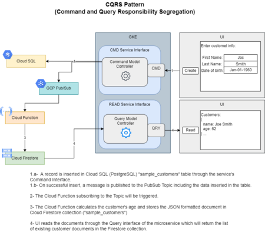

# **Command and Query Responsibility Segregation**

CQRS stands for Command and Query Responsibility Segregation, a pattern that separates read and update operations for a data store. Implementing CQRS in your application can maximize its performance, scalability, and security. The flexibility created by migrating to CQRS allows a system to better evolve over time and prevents update commands from causing merge conflicts at the domain level.

You can find additional details about [CQRS here](https://docs.microsoft.com/en-us/azure/architecture/patterns/cqrs).

# **High-level Architecture**

# **Benefits of CQRS**

- **Independent scaling**. CQRS allows the read and write workloads to scale independently, and may result in fewer lock contentions.
- **Optimized data schemas**. The read side can use a schema that is optimized for queries, while the write side uses a schema that is optimized for updates.
- **Security**. It's easier to ensure that only the right domain entities are performing writes on the data.
- **Separation of concerns**. Segregating the read and write sides can result in models that are more maintainable and flexible. Most of the complex business logic goes into the write model. The read model can be relatively simple. The presence of a cloud function between the data stores also provides separation of concerns and increased maintainability.
- **Simpler queries**. By storing a materialized view in the read database, the application can avoid complex joins when querying.

# **When to use CQRS pattern**

Consider CQRS for the following scenarios:

- Collaborative domains where many users access the same data in parallel. CQRS allows you to define commands with enough granularity to minimize merge conflicts at the domain level, and conflicts that do arise can be merged by the command.

- Task-based user interfaces where users are guided through a complex process as a series of steps or with complex domain models. The write model has a full command-processing stack with business logic, input validation, and business validation. The write model may treat a set of associated objects as a single unit for data changes (an aggregate, in DDD terminology) and ensure that these objects are always in a consistent state. The read model has no business logic or validation stack, and just returns a DTO for use in a view model. The read model is eventually consistent with the write model.

- Scenarios where performance of data reads must be fine-tuned separately from performance of data writes, especially when the number of reads is much greater than the number of writes. In this scenario, you can scale out the read model, but run the write model on just a few instances. A small number of write model instances also helps to minimize the occurrence of merge conflicts.

- Scenarios where one team of developers can focus on the complex domain model that is part of the write model, and another team can focus on the read model and the user interfaces.

- Scenarios where the system is expected to evolve over time and might contain multiple versions of the model, or where business rules change regularly.

- Integration with other systems, especially in combination with event sourcing, where the temporal failure of one subsystem shouldn't affect the availability of the others.

# **Event Sourcing**

Some implementations of CQRS use the [Event Sourcing pattern](https://docs.microsoft.com/en-us/azure/architecture/patterns/event-sourcing). With this pattern, application state is stored as a sequence of events. Each event represents a set of changes to the data. The current state is constructed by replaying the events. In a CQRS context, one benefit of Event Sourcing is that the same events can be used to notify other components — in particular, to notify the read model. The read model uses the events to create a snapshot of the current state, which is more efficient for queries. However, Event Sourcing adds complexity to the design.

# **Potential Data Sources**

Potential data sources for use with the CQRS pattern include SQL and NoSQL databases.

# **Services and Cloud Function**

The CQRS solution includes two GKE workload services and a cloud function:

**CQRS-Command**

- This service will have an API endpoint for inserting a customer record into a PostgreSql table.

- A simple index page is included to prompt for the customer's first name, last name, and date of birth, then invoke the service's CMD API.

- The service will insert a new record into the "sample_customers" table in PostgreSql database.

- Upon successful insert of record, this service will publish a message to the PubSub Topic "cqrs-topic" including the collected customer information.

**CQRS Cloud Function**

- A cloud function is included to be triggered when a new message is published to the "cqrs-topic".

- The cloud function will calculate the age for given customer, then store the new JSON formatted result into cloud Firestore collection "sample_customers".

**CQRS-Query**

- This service will have an API endpoint for querying the list of existing customers.

- This service will return a list of documents from the Firestore collection "sample_customers"

- A simple index page is included for showing the list of customers when invoking the service's QRY API.