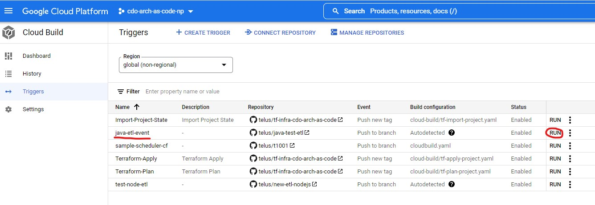

# Data Loss Prevention (Inspection and Classification Solution)
**Using Cloud Function, Storage Buckets and DLP API**

**Event Driven** - A text file is dropped into the source cloud storage bucket, the cloud function automatically picks up the file and classifies the file as either seisitive or non-sensitive by using the DLP API. If the content of the file are classified as containing sensitive data, de-identification process would be performed to mask the sensitive data. After the masking process, the function will then move the file to corresponding storage bucket.

## The GCP services implemented as part of this solution:

**Cloud Storage** - Object storage for GCP. This is where your source and target files will be located.

**Data Loss Prevention API** - GCP Cloud Data Loss Prevention API allows you to inspect, analyze, classify, and redact/de-identify sensitive information within data streams in transit, or data stored at rest in structured / relational databases. In this template we integrated the inspection and de-identification service together to mask and move the sensitive data into different storage bucket based on the inspection result. 
You can find additional information about Google Cloud DLP [here](https://cloud.google.com/dlp)

**Cloud Function** - allows you to run your code in the cloud with no servers or containers to manage. You can find additional details about cloud functions [here.](https://cloud.google.com/functions#section-9)

**Triggers** - Trigger the Cloud Function when a file is dropped into the source Storage Bucket.

## Prerequisite

Before you begin, make sure that you have access to a GCP Project where you would be able to connect to and test your applications. If you need to request for a new GCP project, follow the instruction [here.](https://onboard.cloudapps.telus.com/onboard/home)

In order to test the solution/Cloud Function end to end, teams must ensure that the required GCP service is also created.

- Cloud Function API is enabled
- Cloud Data Loss Prevention (DLP) API is enabled
- The source and two destination storage buckets are created
- The default app engine service account has the required roles. see [dlp_infra Terraform](terraform/dlp_infra.tf)
- The dlp activation request has been submitted to the project at least once. see [dlp activateion](docs/dlp_activation.md)
- The viewer role is assigned to the dlp-api service account. see [dlp_srv Terraform](terraform/dlp_srv.tf)
- Configure the Cloud Build Trigger for deployment pipeline.

Follow the instructions provided [here.](https://simplify.telus.com/docs/developer-docs/docs/topics/applying-terraform-configuration-in-gcp-6e4wBLR5Je9aP5Vd8y70vA.md) to apply the Terraform scripts to your project. 

## Deploying the Cloud Function Manually

To deploy the function manually, you will only need to create a build trigger for this repository. Cloud Build will then read [cloudbuild.yaml](cloudbuild.yaml) and deploy the function accordingly.

**Before you get started:**
- Make sure your source and target buckets in Cloud Storage are configured correctly.
- Check that the bucket names for `_SOURCE_BUCKET`, `_SENSITIVE_BUCKET` and `_NON_SENSITIVE_BUCKET` are correct in [cloudbuild.yaml](cloudbuild.yaml).
- Make note of the `_FUNCTION_TITLE`, your function will be created with that name in the GCP console.
- Check that the Cloud Build and Cloud Function APIs are enabled for your GCP project.

To create a new build trigger, log in to your GCP console and got to **Navigation Menu > Cloud Build > Triggers**.

Select **Create Trigger** at the top of the page to navigate to the trigger creation form. From there, fill out the following required fields:
- The name of your build trigger
- The region for the trigger (select **global** for simplicity's sake)
- The source repository to be used from the drop down menu. If this is the first time you've connected a repository, you will need to:
  - Click **Connect New Repository** which will open a new panel on the right
  - Select **GitHub (Cloud Build GitHub App)** as the source, and continue with authentication. The authentication process may take upwards of 5 minutes to complete
  - Select your repository from the drop down menu and click **Connect**

Once the repository is selected, the branch name should be auto-filled. Leave all other inputs to their default values and click **Create** at the bottom of the form.

Note that the trigger does not run immediately after its creation - you can push a commit to your connected repository to automatically trigger the deployment. Alternatively,
you can click the **Run** button on your new trigger to deploy the function manually.

The function may take a couple of minutes to deploy, you can check the progress on the Cloud Build Dashboard. Once complete, go to **Navigation Menu > Cloud Functions** and
check that your function has been deployed correctly (its name should be the value of `_FUNCTION_TITLE` in [cloudbuild.yaml](cloudbuild.yaml).)

## Adding Collaborators and Working Together
The owner of this repository can add additional admins or collaborators (documentation on access to repositories can be found [here](https://docs.github.com/en/organizations/managing-access-to-your-organizations-repositories/repository-roles-for-an-organization).)

You may currently not have the ability to push code to your `main` branch without additional reviewers. To further customize the rules governing how code is pushed to your branches, [edit your branch protection rules](https://docs.github.com/en/repositories/configuring-branches-and-merges-in-your-repository/defining-the-mergeability-of-pull-requests/managing-a-branch-protection-rule).

We highly recommend that you add an additional reviewer/approver; however, technically as an admin and repo creator, you can bypass by checking the checkbox "*Merge without waiting for requirements to be met*"

## Your feedback is important to us
📝 We are continuously adding more sample applications to the Software Template, implementing new features and functionalities. To help us improve the quality and content of our Software Template, we appreciate your feedback by completing [this short survey](https://forms.gle/UbotjxDVsDmTB3D16), or posting your comments to our [Slack Channel](https://telus-cdo.slack.com/archives/C02KRKNFA2J).
