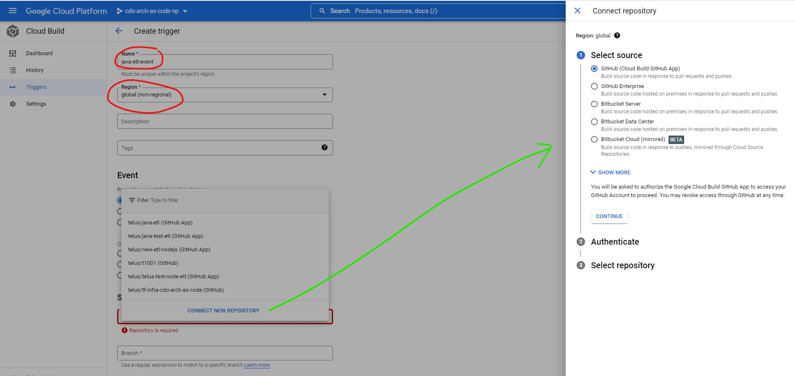
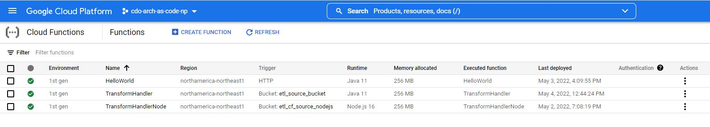

# EDA Solution 
**Using Cloud Function, Firestore, PubSub, and Microservices on GKE**

**Event Driven Architecture** - This sample solution demonstrates a typical EDA process where a Publisher microservice creates a documet in Firestore collection, the Cloud Function will be triggered and publish the document reference to a PubSub Topic, the Consumer (i.e. Subscriber) microservice subscribing to the Topic receives a message including the document reference and updates the document in Firestore.
<p align="center">
  
</p>

## The GCP services implemented as part of this solution:

**Firestore** - NoSQL Document Database. You can find additional details about GCP Firestore [here.](https://cloud.google.com/firestore)

**Cloud Functions** - Allows you to run your code in the cloud with no servers or containers to manage. You can find additional details about cloud functions [here.](https://cloud.google.com/functions#section-9)

**Firestore Triggers** - Trigger the Cloud Function when a file is created in a Firestore Collection. You can find additional details about Firestore Triggers [here.](https://firebase.google.com/docs/functions/firestore-events)

**PubSub** - Allows services to communicate asynchronously, using a publisher and subscriber pattern. You can find additional details about PubSub [here.](https://cloud.google.com/pubsub/docs/overview)

## Prerequisite

Before you begin, make sure that you have access to a GCP Project where you would be able to connect to and test your applications. If you need to request for a new GCP project, follow the instruction [here.](https://onboard.cloudapps.telus.com/onboard/home)

In order to test the Cloud Function, teams must ensure that the Firestore service is enabled in your GCP project and a document collection has been created.

Sample Terraform scripts for enabling Firestore and creating a sample collection: [firestore-{{ cookiecutter.name }}.tf](terraform/firestore-{{ cookiecutter.name }}.tf), and creating a PubSub Topic: [pubsub-{{ cookiecutter.name }}.tf](terraform/pubsub-{{ cookiecutter.name }}.tf) for the demo is provided in the terraform folder.

Follow the instructions provided [here.](https://simplify.telus.com/docs/developer-docs/docs/topics/applying-terraform-configuration-in-gcp-6e4wBLR5Je9aP5Vd8y70vA.md) to apply the Terraform scripts to your project.


## Testing the Cloud Function Locally

The `function-maven-plugin` in the [pom.xml](./pom.xml) provides the `mvn function:run` command, which runs your Cloud Function locally on port `8080` for testing. Make sure you
have set all required environment variables using `export ENV_VAR_1=value` commands before running the function. Then in the directory containing your `pom.xml` file, run:

```
  mvn clean package
  mvn function:run
```

You can then trigger your function using a `curl` command in a separate terminal [as documented in this guide](https://cloud.google.com/functions/docs/calling/cloud-firestore-1st-gen).

For example, suppose a document with ID `YOUR_DOC_ID` is created in the collection `YOUR_COLLECTION` of the `(default)` Firestore instance in the project `YOUR_PROJECT_ID`.
Also suppose the document has the following fields:
```
  user: "Some Person"
  last_login: "2024-05-30T21:20:10.581Z"
  payload: "This is some string data"
```
Then the following `curl` command simulates the event fired from Firestore:
```
  curl localhost:8080 \
  -X POST \
  -H "Content-Type: application/json" \
  -H "ce-id: 123451234512345" \
  -H "ce-specversion: 1.0" \
  -H "ce-time: 2020-01-02T12:34:56.789Z" \
  -H "ce-type: google.cloud.firestore.document.v1.created" \
  -H "ce-source: //firestore.googleapis.com/projects/YOUR_PROJECT_ID/databases/(default)" \
  -d '{
        "oldValue":{},
        "updateMask":{},
        "value":{
          "createTime":"2024-05-30T21:20:46.380943Z",
          "fields":{
            "user":{
              "stringValue":"Some Person"
            },
            "last_login":{
              "timestampValue":"2024-05-30T21:20:10.581Z"
            },
            "payload":{
              "stringValue":"This is some string data"
            }
          },
          "name":"projects/YOUR_PROJECT_ID/databases/(default)/documents/YOUR_COLLECTION/YOUR_DOC_ID",
          "updateTime":"2024-05-30T21:20:46.380943Z"
        }
      }'
```


## Deploying the Cloud Function Manually

To deploy the function manually, you will only need to create a build trigger for this repository. Cloud Build will then read [cloudbuild.yaml](cloudbuild.yaml) and
deploy the function accordingly.

**Before you get started:**
- Make sure Firestore is enabled and the sample collection is created.
- Make sure that the PubSub Topic is created in your GCP project.
- Check that the firestore collection name for `_FIRESTORE_COLLECTION` and `_EDA_TOPIC` are correct in [cloudbuild.yaml](cloudbuild.yaml).
- Make note of the `_FUNCTION_TITLE`, your function will be created with that name in the GCP console.
- Check that the Cloud Build and Cloud Function APIs are enabled for your GCP project.

To create a new build trigger, log in to your GCP console and got to **Navigation Menu > Cloud Build > Triggers**.


Select **Create Trigger** at the top of the page to navigate to the trigger creation form. From there, fill out the following required fields:
- The name of your build trigger
- The region for the trigger (select **global** for simplicity's sake)
- The source repository to be used from the drop down menu. If this is the first time you've connected a repository, you will need to:
  - Click **Connect New Repository** which will open a new panel on the right
  - Select **GitHub (Cloud Build GitHub App)** as the source, and continue with authentication. The authentication process may take upwards of 5 minutes to complete
  - Select your repository from the drop down menu and click **Connect**

Once the repository is selected, the branch name should be auto-filled. Leave all other inputs to their default values and click **Create** at the bottom of the form.



Note that the trigger does not run immediately after its creation - you can push a commit to your connected repository to automatically trigger the deployment. Alternatively,
you can click the **Run** button on your new trigger to deploy the function manually.


The function may take a couple of minutes to deploy, you can check the progress on the Cloud Build Dashboard. Once complete, go to **Navigation Menu > Cloud Functions** and
check that your function has been deployed correctly (its name should be the value of `_FUNCTION_TITLE` in [cloudbuild.yaml](cloudbuild.yaml).)



## Adding Collaborators and Working Together
The owner of this repository can add additional admins or collaborators (documentation on access to repositories can be found [here](https://docs.github.com/en/organizations/managing-access-to-your-organizations-repositories/repository-roles-for-an-organization).)

You may currently not have the ability to push code to your `main` branch without additional reviewers. To further customize the rules governing how code is pushed to your branches, [edit your branch protection rules](https://docs.github.com/en/repositories/configuring-branches-and-merges-in-your-repository/defining-the-mergeability-of-pull-requests/managing-a-branch-protection-rule).


We highly recommend that you add an additional reviewer/approver; however, technically as an admin and repo creator, you can bypass by checking the checkbox "*Merge without waiting for requirements to be met*"

## Your feedback is important to us
📝 We are continuously adding more sample applications to the Software Template, implementing new features and functionalities. To help us improve the quality and content of our Software Template, we appreciate your feedback by completing [this short survey](https://forms.gle/UbotjxDVsDmTB3D16), or posting your comments to our [Slack Channel](https://telus-cdo.slack.com/archives/C02KRKNFA2J).
