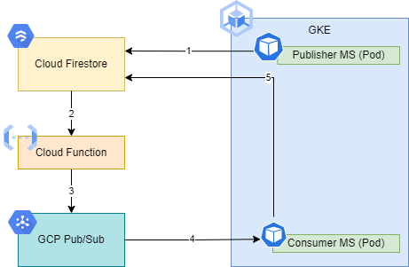

# **EDA Publisher Service**
**Using Cloud Function, Firestore, PubSub, and Microservices on GKE**

**Event Driven Architecture** - This sample solution demonstrates a typical EDA process where a Publisher microservice creates a documet in Firestore collection, the Cloud Function will be triggered and publish the document reference to a PubSub Topic, the Consumer (i.e. Subscriber) microservice subscribed to the Topic receives a message including the document reference and updates the document in Firestore.

  

## The GCP services implemented as part of this solution:

**Firestore** - NoSQL Document Database. You can find additional details about GCP Firestore [here.](https://cloud.google.com/firestore)

**Cloud Functions** - Allows you to run your code in the cloud with no servers or containers to manage. You can find additional details about cloud functions [here.](https://cloud.google.com/functions#section-9)

**Firestore Triggers** - Trigger the Cloud Function when a file is created in a Firestore Collection. You can find additional details about Firestore Triggers [here.](https://firebase.google.com/docs/functions/firestore-events)

**PubSub** - Allows services to communicate asynchronously, using a publisher and subscriber pattern. You can find additional details about PubSub [here.](https://cloud.google.com/pubsub/docs/overview)

## Prerequisite

Before you begin, make sure that you have access to a GCP Project where you would be able to connect to and test your applications. If you need to request for a new GCP project, follow the instruction [here.](https://onboard.cloudapps.telus.com/onboard/home)

In order to test the Publisher service , teams must ensure that the Firestore service is enabled in your GCP project and a document collection has been created.

Sample Terraform scripts for enabling Firestore and creating a sample collection: [firestore-{{ cookiecutter.name }}.tf](terraform/firestore-{{ cookiecutter.name }}.tf) for the demo is provided in the terraform folder.

Follow the instructions provided [here.](https://simplify.telus.com/docs/developer-docs/docs/topics/applying-terraform-configuration-in-gcp-6e4wBLR5Je9aP5Vd8y70vA.md) to apply the Terraform scripts to your project. 
