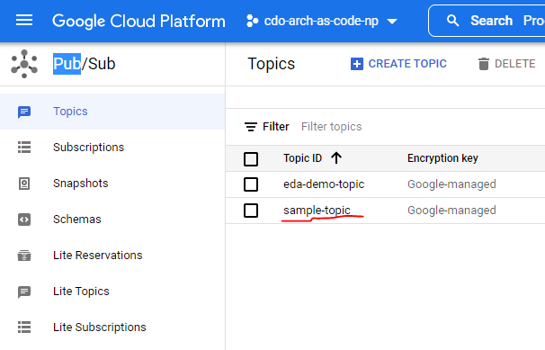
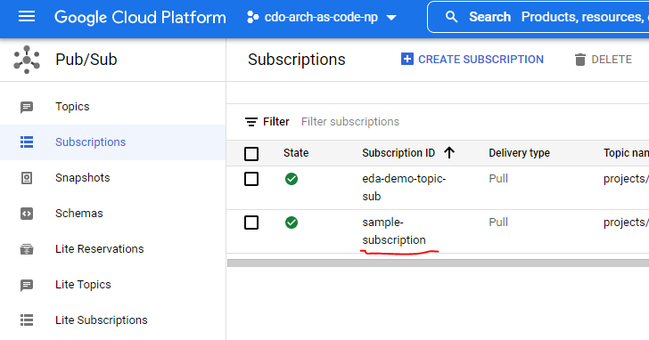

## **Cloud Pub/Sub Demo**

You can check the list of available topics/subscriptions for your project in the GCP console, in **Navigation Menu > Pub/Sub**.
This demo assumes that the topic and subscription you will be using has already been created, and that you have gone through
[your local/codespaces setup](../../../../README.md).




The [Application](../src/main/java/com/telus/samples/Application.java) uses the subscription name stored in
[application.properties](../src/main/resources/application.properties), in the property *example.subscriber.subscription_name*. If the current value of that
property does not match the name in GCP, then overwrite that property with the correct name. As an example, if *sample-subscription*
is the name of the subscription we wish to use - then in the application.properties file, we should have:
```
# Name of the topic to be used in the sample app
example.subscriber.subscription_name=sample-subscription
```